#### SQL语句分类
* DDL（Data Definition Languages）语句：数据定义语言，这些语句定义了不同的数据段、数据库、表、列、索引等数据库对象的定义。常用的语句关键字主要包括 create、drop、alter等。
* DML（Data Manipulation Language）语句：数据操纵语句，用于添加、删除、更新和查询数据库记录，并检查数据完整性，常用的语句关键字主要包括 insert、delete、udpate 和select 等。(增添改查）
* DCL（Data Control Language）语句：数据控制语句，用于控制不同数据段直接的许可和访问级别的语句。这些语句定义了数据库、表、字段、用户的访问权限和安全级别。主要的语句关键字包括 grant、revoke 等

#### SQL语句执行流程
* 连接器：连接管理，权限认证
* 分析器：词法分析，语法分析
* 优化器：索引选择，连接顺序等
* 执行器：调用存储引擎接口，返回结果

#### 日志
redo log: innodb层，固定大小，循环写。物理日志，记录的是"在某个数据页上做了什么修改"
binlog: Server层，逻辑日志，记录的是这个语句的原始逻辑，比如“给 ID=2 这一行的 c 字段加 1”

#### 更新流程：
1. 执行器向引擎查找对应行数据。若这一行所在数据页在内存中，则直接放回，否则将页数据从磁盘读到内存再返回
2. 执行器执行更新操作，得到新的行，并调用引擎接口写入这行新数据
3. 引擎将这行新数据更新到内存中，同时将更新操作记录到redo log，此时redo log处于prepare状态
3. 执行器生成操作的binlog，并将binlog写磁盘
4. 执行器调用引擎的提交事务接口，redo log改成commit状态，更新完成

#### 隔离级别
* 读未提交（read uncommitted）：一个事务还没提交时，它做的变更就能被别的事务看到
* 读提交（read committed）：一个事务提交之后，它做的变更才会被其他事务看到
* 可重复读（repeatable read）：一个事务执行过程中看到的数据，总是跟这个事务在启动时看到的数据是一致的，未提交变更对其他事务也是不可见的
* 串行化（serializable ）：对于同一行记录，“写”会加“写锁”，“读”会加“读锁”。当出现读写锁冲突的时候，后访问的事务必须等前一个事务执行完成，才能继续执行

#### 事务隔离的实现
* 每条记录更新时会同时记录一条回滚日志，记录上的最新值，通过回滚操作可以得到前一个状态的值
* 不同时段启动的事务，会有不同的read-view，read-view即对应数据的某个版本，在读取的时候，通过最新版本和回滚日志得到对应版本的数据，这样就可保证不管数据怎么更新，始终都能读到到自己想要的版本
* 当系统里没有比回滚日志更早的read-view时，回滚日志会被删除

#### 事务启动方式
* 显示启动，begin 或 start transaction。配套的提交语句是 commit，回滚语句是 rollback
* set autocommit=0，这个命令会将这个线程的自动提交关掉。意味着如果你只执行一个 select 语句，这个事务就启动了，而且并不会自动提交。这个事务持续存在直到你主动执行 commit 或 rollback 语句，或者断开连接

set autocommit=0如果是长连接，会导致长事务的风险。如果执行 commit work and chain，则是提交事务并自动启动下一个事务，这样也省去了再次执行 begin 语句的开销

在 information_schema 库的 innodb_trx 这个表中查询长事务

#### 索引
innoDB使用B+树索引模型，采用N叉树，减少树高，加快查询，只有叶子节点才存储数据

主键索引，也称为聚簇索引，叶子节点存储的是整行数据
非主键索引，也称二级索引，叶子节点存储的是主键值，查询时需要根据主键值再查询主键索引才能拿到整行数据，这个过程称作回表

索引维护：页数据已满会分裂，相反，页利用率很低的时候相邻页会合并

自增字段做主键的好处：字段占用空间小，减少普通索引叶子节点大小。插入有序，页数据顺序写，减少分裂

重建索引：重建非主键索引可以先drop再add索引，重建主键不能这么做，因为会导致整个表重建，应该采用alter table T engine=InnoDB

覆盖索引：索引上已经包含查询所需字段，可以减少回表
最左前缀原则：索引项是按照索引定义里面出现的字段顺序排序的，最左前缀可以是联合索引的最左 N 个字段，也可以是字符串索引的最左 M 个字符，通过调整数据，可以减少索引的维护，如有了(a,b)索引就不需要a索引
索引下推（index condition pushdown）：在索引遍历过程中，对索引中包含的字段先做判断，直接过滤掉不满足条件的记录，减少回表次数

#### 锁
**全局锁**：命令Flush tables with read lock (FTWRL)，典型应用场景是做全库逻辑备份，备份过程数据库处于只读状态

备份全库的其它实现方式
1. 在可重复度隔离级别下开启事务，但是需要引擎支持
2. set global readonly=true。readonly 的值会被用来做其他逻辑，比如用来判断一个库是主库还是备库。异常处理机制不同，执行 FTWRL 命令之后由于客户端发生异常断开，那么 MySQL 会自动释放这个全局锁，而设置为 readonly 之后，如果客户端发生异常，则数据库就会一直保持 readonly 状态

**表锁**：语法lock tables … read/write。与 FTWRL 类似，可以用 unlock tables 主动释放锁，也可以在客户端断开的时候自动释放。InnoDB支持行锁的引擎一般不使用

**元数据锁**（meta data lock，MDL）：在访问表的时候会被自动加上，提交事务的时候释放。对表做增删改查加读锁，表结构变更加表锁
    
**行锁**：需要的时候才加上，事务结束才释放

**死锁检测**  
等待超时，通过参数 innodb_lock_wait_timeout 来设置。使用较少，设置太长造成业务不可用，太短可能误伤
主动检测，发现死锁后，主动回滚死锁链条中的某一个事务。将参数 innodb_deadlock_detect 设置为 on表示开启。如果多个客户端同时更新同一行，死锁检测会消耗很多CPU

**事务的启动时机**  
* 使用begin/start transaction 命令，在执行到它们之后的第一个操作 InnoDB 表的语句时事务才真正启动，一致性视图是在执行第一个快照读语句时创建的
* 使用 start transaction with consistent snapshot 命令，立马启动事务并创建一致性视图

#### MVCC原理

事务启动时分配transaction id，按申请顺序严格递增
事务更新行时，将transaction id赋值给数据版本的事务ID，记为row trx_id，每个版本的数据都有自己的row trx_id
在可重复读级别下，事务读取一行数据时，根据回滚日志遍历所有版本，找到可见的版本，如果数据为本事务更新，也是可见的

事务启动时记录当前系统活跃事务ID集合，视图数组和高水位组成当前事务的一致性视图
低水位：当前活跃事务里事务ID最小的
高水位：当前系统里已经创建过的事务ID的最大值加1

判断版本可见方式
版本小于低水位：可见
版本大于等于高水位：不可见
介于两者之间：版本在视图数组中不可见，否则可见

#### 当前读
更新数据都是先读后写的，而这个读，只能读当前的值，称为“当前读”（current read），select 语句如果加锁，也是当前读

表结构不支持可重复读，因为表结构没有对应的行数据，也没有row rtx_id，只能使用当前读

#### change buffer
更新数据时，如果内存中没有数据页，会将更新操作记录到change buffer。后续有数据页的访问时，将数据页从磁盘读入内存，并将change buffer应用到数据页，这个过程叫merge。系统定期也会在后台触发数据页的merge。change buffer也会记录磁盘，防止丢失

唯一索引的更新无法使用change buffer，因为需要判断数据的唯一性，必须读取数据页才能判断

#### 索引选择
优化器在索引选择时，会根据扫描行数和回表次数综合选择。索引上不同值的个数，称为"基数"（cardinality），这个值越大，区分度越大，越容易被优化器选择

基数通过采样得到，InnoDB 默认会选择 N 个数据页，统计这些页面上的不同值，得到一个平均值，然后乘以这个索引的页面数，就得到了这个索引的基数。当变更的数据行数超过 1/M 的时候，会自动触发重新做一次索引统计

存储索引统计的方式根据innodb_stats_persistent来选择

* 设置为on，持久化存储。N=20，M=10
* 设置为off，存在内存中。N=8，M=16

analyze table t可以重新统计索引信息，force index可以强制选择索引。优化器根据索引统计信息，有时候可能选择错误的索引，比如删除数据再插入数据，如果这个过程中有其它未提交的事务，数据不会被真正删除，统计扫描行数的时候可能会加倍

#### 索引优化
给字符串添加索引，可以使用前缀索引，节省索引空间，但是要考虑索引区分度，前缀索引无法使用索引覆盖的优化，必须进行回表
常见的字符串索引优化方式：
1. 前缀区分度不过，可以使用倒序存储
2. 添加一个hash字段单独做索引等方式

#### 数据页
内存数据页和磁盘数据页不一致，称作脏页。脏页刷磁盘场景：
1. redo log写满，checkpoint往前推，对应的所有脏页写磁盘
2. 内存不够用，将内存脏页写磁盘
3. 后台空闲的时候将脏页写磁盘
4. MySQL正常关闭，将脏页谢磁盘

innodb_flush_neighbors设置为1，在刷脏页的时候如果相邻页也是脏页，也会刷磁盘，并且这个策略会继续传递。innodb_io_capacity设置磁盘能力，会影响刷脏页性能

innodb_file_per_table推荐设置为on，每个表用单独文件存储

数据页上的记录被删除，该记录可以复用，但仅限于符合范围条件的数据
数据页上的所有记录被删除，数据页可以复用，可以复用到任意位置
相邻两个数据页利用率都很低，系统给可能会将数据合并到一个数据页，另一个数据页标记为可复用

delete数据只会让记录或数据页被复用，无法清理磁盘空间。插入也可能造成数据页里记录的空洞，比如要插入的数据页已满，则会申请新的数据页并进行分裂，这样数据页末尾就存在空洞

重建表可以减少空洞，重建表流程
1. 建立一个临时文件，扫描原表所有数据页
2. 用原表数据页生成B+树，存到临时文件
3. 生成临时文件过程中，对原表的操作记录都日志文件（raw log）中
4. 临时文件生成后，将日志文件中的操作应用到临时文件
5. 用临时文件替换原表的数据文件

这个过程允许对原表做增删改查操作，称作Online DDL。Online DDL 其实是会先获取MDL写锁, 再退化成MDL读锁；但MDL写锁持有时间比较短，所以可以称为Online； 而MDL读锁，不阻止数据增删查改，但会阻止其它线程修改表结构

#### Online 和 inplace
Online DDL 过程都在 InnoDB 内部完成，对于 server 层来说，没有把数据挪动到临时表，是一个“原地”操作，这就是“inplace”名称的来源
DDL 过程如果是 Online 的，就一定是 inplace 的；反过来未必，也就是说 inplace 的 DDL，有可能不是 Online 的。截止到 MySQL 8.0，添加全文索引（FULLTEXT index）和空间索引 (SPATIAL index) 就属于这种情况。

重建表的语句`alter table t engine=InnoDB`其实隐含语句是`alter table t engine=innodb,ALGORITHM=inplace;`跟 inplace 对应的就是拷贝表的方式了，用法是`alter table t engine=innodb,ALGORITHM=copy;`

#### count(*)实现
MyISAM将表的行数单独存储，获取很快，但不支持事务
InnoDB需要扫描全部数据得到行数，但会做一些优化，比如选择空间最小的索引进行遍历。之所以要遍历，是为了实现MVCC，同一时刻不同事务所见的行数是不一样的

如果要实现高性能的计数，应该用额外的表来单独维护

不同count的效率比较：`count(字段)<count(主键 id)<count(1)≈count(*)`

* `count(字段)`: 取字段值，判断非空，统计行数
* `count(主键 id)`: 取主键id，统计行数
* `count(1)`: 遍历整张表，不取值，server对于返回的每一行放一个数字"1"进去，统计行数
* `count(*)`: 专门做了优化，遍历整张表，不取值，统计行数

#### 崩溃恢复
binlog写完但redo log还没commit，崩溃恢复处理
1. 如果redo log里的事务是完整的，也就是已经有了commit标识，则直接提交
2. 如果redo log的事务只有完整的prepare，则判断对应的事务binlog是否存在并完整，如果是，则提交事务，如果否，则回滚事务

如何判断binlog是否完整
* statement格式的binlog，最后会有COMMIT
* row格式的binlog，最后会有一个XID event。redo log和binlog通过XID关联

#### order by
`select A,B,C from t where A='xx' order by B limit 1000`工作流程

1. 如果存在覆盖索引(A,B,C)，无需排序，直接从索引里取满足条件的1000行
2. 如果存在联合索引(A,B)，无需排序，从索引里取满足条件的1000个主键ID，再回表拿到对应结果
3. 如果没有对应索引，则使用sort_buffer进行排序
    
查询行的长度小于等于max_length_for_sort_data，使用全字段排序
1. 查找满足条件的主键
2. 回表拿到所有查询字段，放入sort_buffer
3. sort_buffer根据排序字段进行排序
4. 返回前1000行

查询行的长度大于max_length_for_sort_data，使用rowid排序
1. 查找满足条件的主键
2. 回表拿到排序字段，将主键和排序字段放入sort_buffer
3. sort_buffer根据排序字段进行排序
4. 返回前1000行主键
5. 回表拿到所有查询字段

使用sort_buffer排序时如果需要的内存超过sort_buffer_size，则会使用临时文件进行排序，number_of_tmp_files的值表示使用临时文件的数量

explain命令的Extra 字段显示 Using filesort表示需要执行排序操作，Using temporary表示需要使用临时表，如`order by rand()`就会用到临时表，如果临时表需要的内存小于等于tmp_table_size则使用内存临时表，引擎为memory，超过该值则使用磁盘临时表，默认引擎是InnoDB

#### 索引失效
对查询字段做函数操作或隐式转换会导致无法使用索引查找，有如下几种情况
* 对索引字段做函数操作，如`select count(*) from tradelog where month(t_modified)=7`或`where id + 1 = 1000`
* 字符串和数字做比较，会将字符串转换成数字，如`select * from tradelog where tradeid=110717`，tradeid会被转换成数字再作比较
* 不同字符集的比较，如utf8字符和utf8mb4字符比较，会将utf8转换成utf8mb4，如果查询字段为utf8，则无法使用索引查找，如`select d.* from tradelog l, trade_detail d where d.tradeid=l.tradeid and l.id=2`，其中d.tradeid为utf8，l.tradeid为utf8mb4

#### 慢查询
查询一行语句也很慢的场景，如`select * from t where id=1`
1. 等MDL锁，如有其它session执行了`lock table t write`，可以用`select blocking_id from sys.schema_table_lock_waits`查找造成阻塞的pid，然后用`kill <pid>`断开连接
2. 等flush，session A执行`select sleep(1) from t`，session B执行`flush table t`，session C执行 `select * from t where id=1`就会被阻塞
3. 等行锁，session A执行`begin; update t set c=c+1 where id=1`，session B执行`select * from t where id=1 lock in share mode`，可以通过sys.innodb_lock_waits查到谁占有写锁
    
    ```
    mysql> select * from t sys.innodb_lock_waits where locked_table='`test`.`t`'\G
    ```
    
    结果格式如下
    
    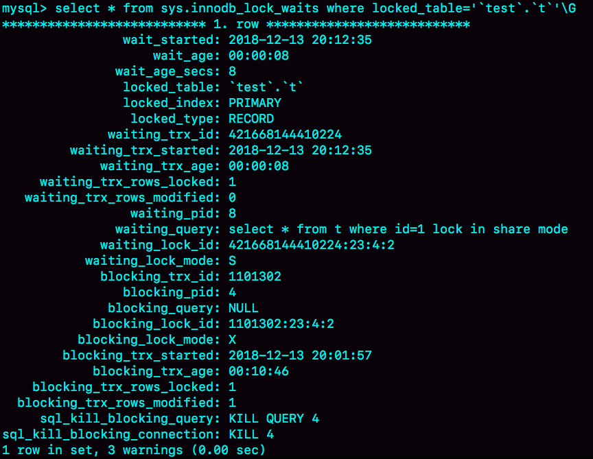
    
    通过`KILL 4`可以断开造成阻塞的连接
    
4. undo log太长，如以下执行顺序，session A启动一致性读，session B更新完后生成了100万个回滚日志，此时session A再执行`select * from t where id=1`就会执行100万次回滚操作才能拿到最初的结果，而`select * from t where id=1 lock in share mode`是当前读，加锁反而读的更快

    
   
#### 间隙锁
间隙锁只在可重复度隔离级别下生效，在读提交隔离级别下，为了解决可能出现数据和日志不一致问题，需要把binlog格式设置为row

间隙锁和间隙锁之间不冲突，只会影响insert操作

间隙锁和行锁合称next-key lock，是一个前开后闭的区间，加锁规则

1. 加锁的基本单位都是next-key lock
2. 查找过程中访问到的对象才会加锁
3. 索引上的等值查询，给唯一索引加锁的时候，next-key lock退化为行锁
4. 索引上的等值查询，向右遍历时且最后一个值不满足等值条件的时候，next-key lock退化为间隙锁
5. 唯一索引上的范围查询会访问到不满足条件的第一个值为止

间隙锁案例，假设数据格式为
```
CREATE TABLE `t` (
  `id` int(11) NOT NULL,
  `c` int(11) DEFAULT NULL,
  `d` int(11) DEFAULT NULL,
  PRIMARY KEY (`id`),
  KEY `c` (`c`)
) ENGINE=InnoDB;

insert into t values(0,0,0),(5,5,5),
(10,10,10),(15,15,15),(20,20,20),(25,25,25);
```

1. 等值查询间隙锁，session A加锁区间是(5,10)，规则1+4

    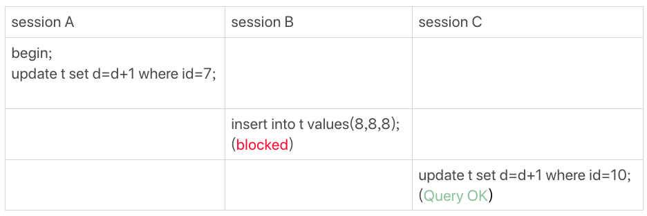

2. 非唯一索引等值锁，session A对索引c的加锁范围为(0,10)，由于使用索引覆盖，不需要访问主键，所以主键索引上没有加锁，因此session B的update操作可以执行

    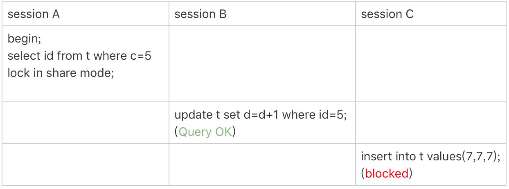

3. 主键索引范围锁

    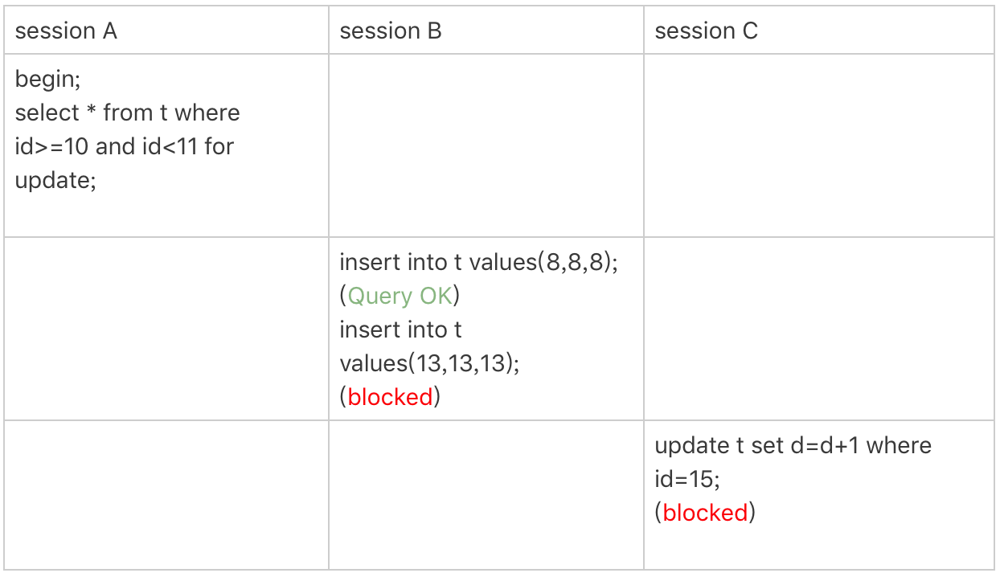
    
    扫描到id=10时，是当做等值条件判断，在唯一索引上退化为行锁
    扫描到id=15时，是当范围查询判断，加锁为next-key lock，(10,15]，因此整个加锁区间为[10,15]
    
4. 非唯一索引范围锁

    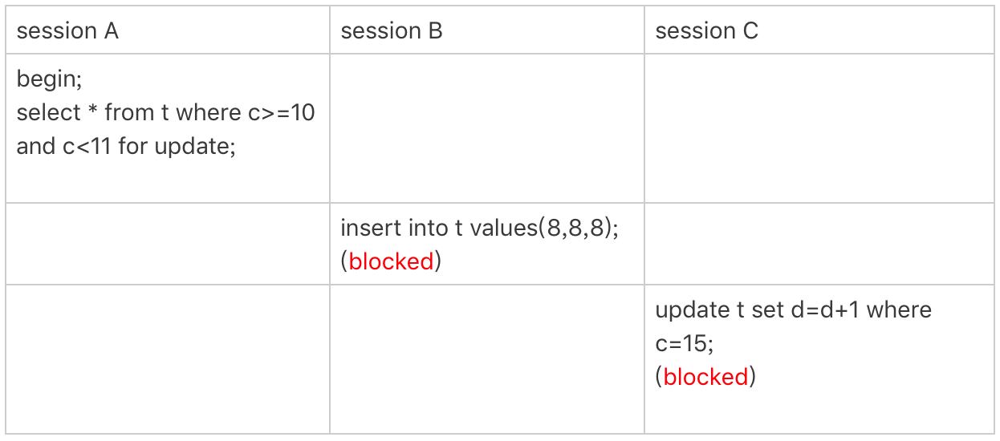
    
    和3的区别是c是非唯一索引，因此加锁区间无法退化为行锁，最终加锁范围为(5,15]

5. 唯一索引范围锁特例

    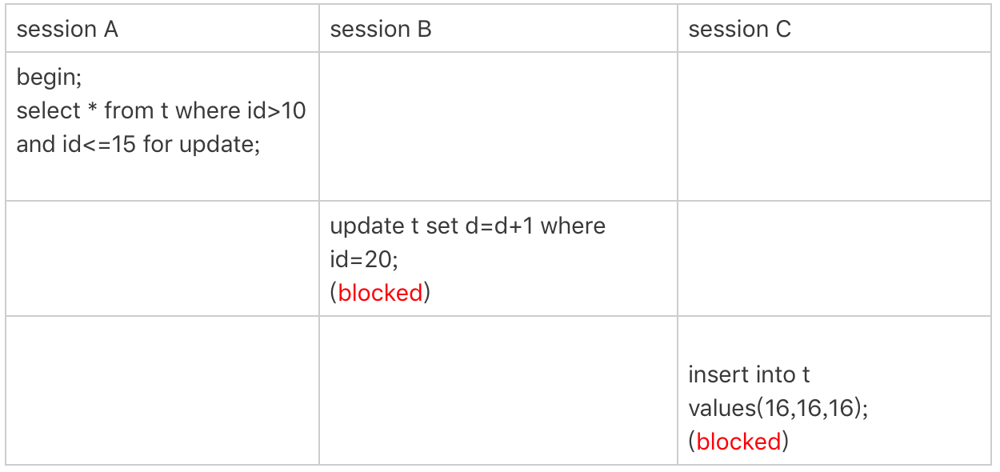
    
    唯一索引也会扫描到下一个不满足条件的值为止，因此加锁区间是(10,20]
    
6. 非唯一索引上存在"等值"的例子

    
     
    delete语句和select for update加锁逻辑一致，在以上数据上执行如下操作，加锁区间为(5,15)
    
    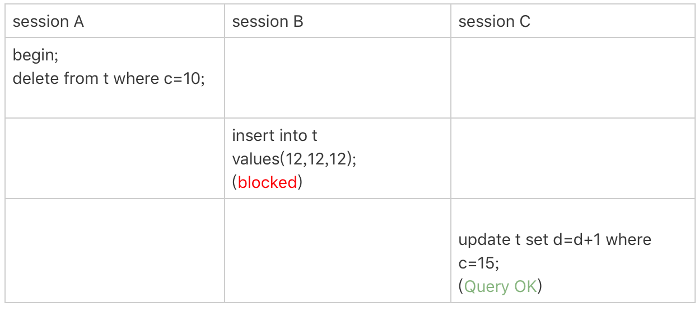
    
7. limit 语句加锁

    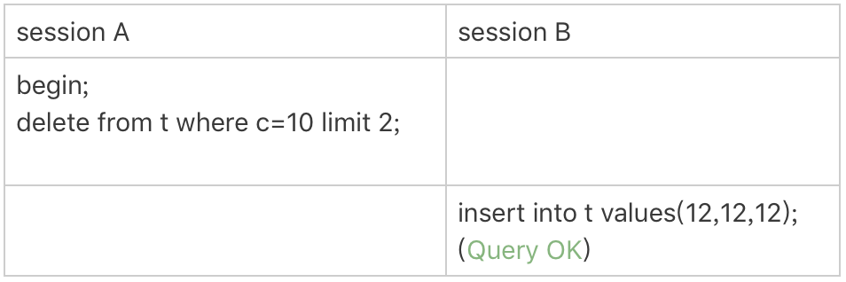
    
    在6的数据基础上执行删除，添加了limit 2限制，这是遍历到c=10的两条记录后，已经满足条件，无需再向后遍历，因此加锁区间为(5,1]
    
8. 一个死锁的例子

    
    
    next-key lock由间隙锁和行锁组成，加锁的时候是分开执行的，A的select操作加间隙锁(5,10)和行锁10，B的update操作同样需要加间隙锁(5,10)和行锁10，但是间隙锁是可以共存的，因此B加间隙锁成功，加行锁阻塞，此时A的insert语句被B的间隙锁阻塞，因此形成死锁
    
9. 逆序查找

    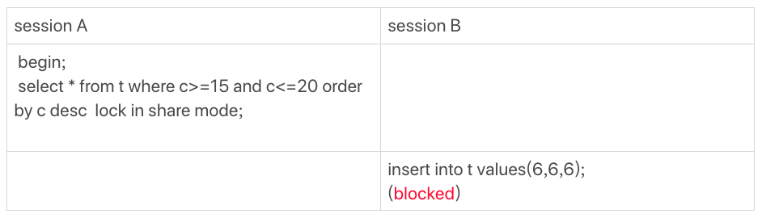
    
    由于是逆序查找，等值查询id=20加next-key lock (15,20]，再找一个不满足条件的值，加间隙锁(20,25)，再向上遍历找到不满足条件的id=10为止，next-key lock会加到（5,10]，因此最终索引c上的加锁范围为(5,25)，主键加锁为id=15,20三个行锁
    
读提交隔离级别下，语句执行过程中加上的行锁，在语句执行完成后，就要把“不满足条件的行”上的行锁直接释放了，不需要等到事务提交
   
#### 极端场景处理
1. 短链接风暴
    
    * 杀掉空闲连接。show processlist查看连接状态，从information_schema.innodb_trx 查询事务状态，trx_row_modified为0代表该事务没有修改过数据，可以杀掉
    * 减少连接过程的消耗。重启数据库，使用-skip-grant-tables参数，调过权限验证

2. QPS 突增问题
    
    * 如果是单独的数据库，可以删掉用户，让新连接连不成功
    * 使用查询重写功能，把压力最大的 SQL 语句直接重写成"select 1"返回

#### 日志写入
**binlog写入机制**

每个线程在内存分配binlog cache，大小由binlog_cache_size参数控制，事务执行过程中先写binlog cache，事务提交的时候，将binlog cache写到binlog文件中

写文件有write和fsync接口，write是写文件系统的页缓存，fsync才真正刷磁盘。调用时机由参数sync_binlog控制
1. sync_binlog=0 的时候，表示每次提交事务都只 write，不 fsync
2. sync_binlog=1 的时候，表示每次提交事务都会执行 fsync
3. sync_binlog=N(N>1) 的时候，表示每次提交事务都 write，但累积 N 个事务后才 fsync

**redo log写入机制**

先写redo log buffer，再write写文件，fsync刷磁盘，写入策略由innodb_flush_log_at_trx_commit参数控制
1. 设置为 0 的时候，表示每次事务提交时都只是把 redo log 留在 redo log buffer 中
2. 设置为 1 的时候，表示每次事务提交时都将 redo log 直接持久化到磁盘
3. 设置为 2 的时候，表示每次事务提交时都只是把 redo log 写到 page cache

InnoDB后台线程每隔1秒会把redo log buffer中的日志，调用write写到文件系统的page cache，然后调用 fsync 持久化到磁盘，事务执行过程中的redo log buffer可能在这时候会被后台线程刷磁盘

未提交事务的redo log buffer还在以下场景会被写入磁盘

1. redo log buffer 占用的空间即将达到 innodb_log_buffer_size 一半的时候，后台线程会主动写盘。由于事务未提交，此时写文件调的是write而非fsync
2. 并行的事务提交的时候，会顺带将别的事务的redo log buffer持久化到磁盘。如事务A未提交，此时另一个线程的事务B提交，如果 innodb_flush_log_at_trx_commit 设置的是 1，就会顺带将事务A在redo log buffer里的日志写到磁盘

如果把 innodb_flush_log_at_trx_commit 设置成 1，那么 redo log 在 prepare 阶段就要持久化一次，每秒一次后台轮询刷盘，再加上崩溃恢复这个逻辑，InnoDB 就认为 redo log 在 commit 的时候就不需要 fsync 了，只会 write 到文件系统的 page cache 中就够了。

双 1”配置，指的就是 sync_binlog 和 innodb_flush_log_at_trx_commit 都设置成 1。也就是说，一个事务完整提交前，需要等待两次刷盘，一次是 redo log（prepare 阶段），一次是 binlog

**组提交机制**

LSN（log sequence number，日志逻辑序列号）是单调递增的，用来对应 redo log 的一个个写入点。每次写入长度为 length 的 redo log， LSN 的值就会加上 length

假设有三个并发的事务在prepare阶段，都写完redo log buffer要刷磁盘，对应LSN分别为50、120、150，如下图


则执行流程如下

1. trx1 是第一个到达的，会被选为这组的 leader
2. 等 trx1 要开始写盘的时候，这个组里面已经有了三个事务，这时候 LSN 也变成了 160
3. trx1 去写盘的时候，带的就是 LSN=160，因此等 trx1 返回时，所有 LSN 小于等于 160 的 redo log，都已经被持久化到磁盘
4. 这时候 trx2 和 trx3 就可以直接返回了

一次组提交里，组员越多，节约磁盘IOPS效果约好

MySQL 为了让组提交的效果更好，调整了fsync的执行时机，如下图，

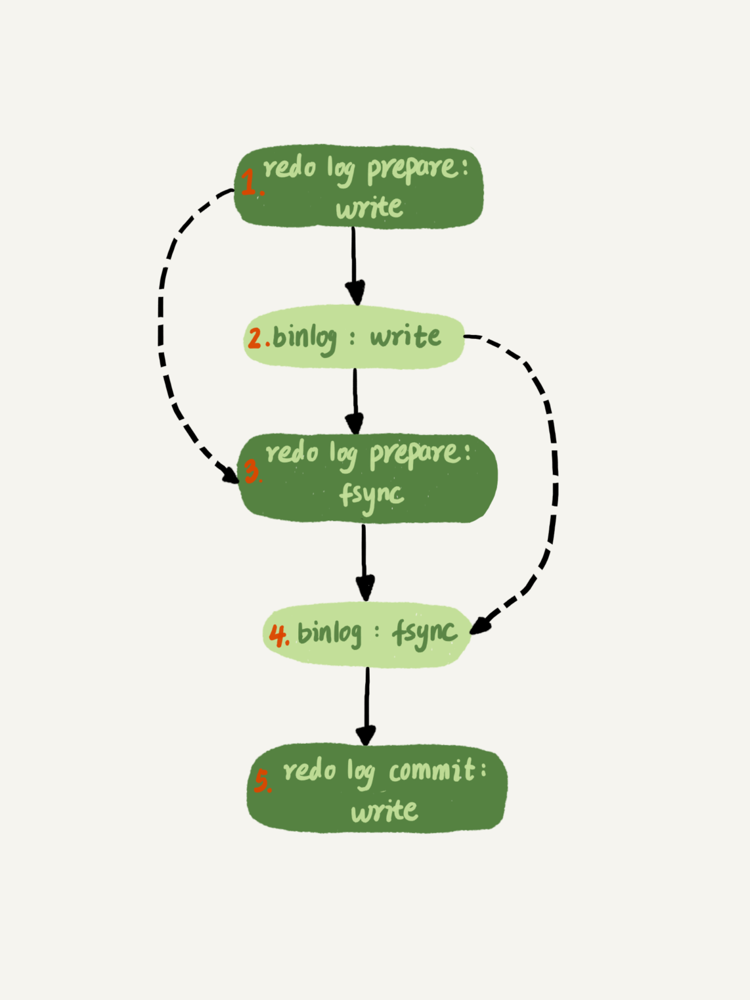

这样binlog也可以组提交，使用binlog_group_commit_sync_delay 和 binlog_group_commit_sync_no_delay_count 来实现，两个条件是或关系，满足一个即提交

1. binlog_group_commit_sync_delay 参数，表示延迟多少微秒后才调用 fsync
2. binlog_group_commit_sync_no_delay_count 参数，表示累积多少次以后才调用 fsync。


要提升IOPS性能，可以考虑如下方法

1. 设置 binlog_group_commit_sync_delay 和 binlog_group_commit_sync_no_delay_count 参数，减少 binlog 的写盘次数。这个方法是基于“额外的故意等待”来实现的，因此可能会增加语句的响应时间，但没有丢失数据的风险
2. 将 sync_binlog 设置为大于 1 的值（比较常见是 100~1000）。这样做的风险是，主机掉电时会丢 binlog 日志
3. 将 innodb_flush_log_at_trx_commit 设置为 2。这样做的风险是，主机掉电的时候会丢数据。

update语句在节点A执行，同步到节点B的流程
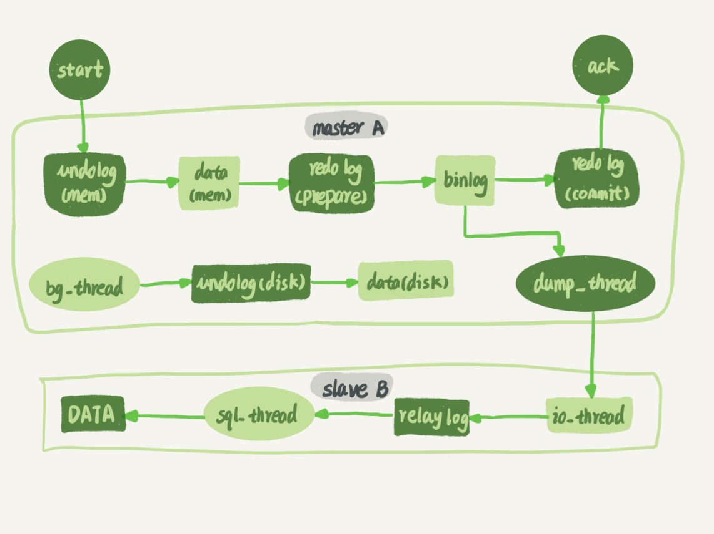

#### 日志同步
一个事务日志同步到完整过程
1. 在备库B上通过change master命令，设置主库A的IP、端口、用户、密码以及要从哪个位置开始请求binlog，这个位置包含文件名和日志偏移量
2. 在备库B上执行start slave命令，这时候备库会启动两个线程，就是图中的io_thread和sql_thread，其中io_thread负责与主库建立连接
3. 主库A校验完用户名、密码后，开始按照备库B传过来的位置，从本地读取binlog，发给B
4. 备库B拿到binlog后，写到本地文件，称为中转日志（relay log）
5. sql_thread读取中转日志，解析出日志里的命令，并执行

多线程复制方案引入之后，sql_thread演化成了多个线程

binlog三种格式

表结构为
```
mysql> CREATE TABLE `t` (
  `id` int(11) NOT NULL,
  `a` int(11) DEFAULT NULL,
  `t_modified` timestamp NOT NULL DEFAULT CURRENT_TIMESTAMP,
  PRIMARY KEY (`id`),
  KEY `a` (`a`),
  KEY `t_modified`(`t_modified`)
) ENGINE=InnoDB;

insert into t values(1,1,'2018-11-13');
insert into t values(2,2,'2018-11-12');
insert into t values(3,3,'2018-11-11');
insert into t values(4,4,'2018-11-10');
insert into t values(5,5,'2018-11-09');
```

执行语句为
```
mysql> delete from t /*comment*/  where a>=4 and t_modified<='2018-11-10' limit 1;
```

binlog_format=statement，binlog里记录的是SQL语句原文，

查看binlog内容
```
mysql> show binlog events in 'master.000001';
```

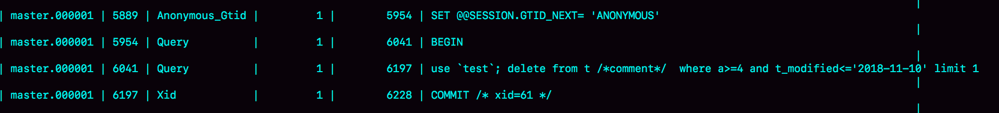

这条delete语句会产生warning

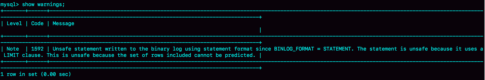

当delete带limit时，如果使用的索引不同，则删除的数据可能也不同。因为binlog格式为statement，记录到binlog里的是语句原文，因此备库执行的时候，如果使用了不同索引，会造成数据不一致，所以会产生warning

binlog_format='row'，binlog里记录的是真实删除主键的id，这样传到备库执行时，就不会有主备删除不同行的问题

binlog内容
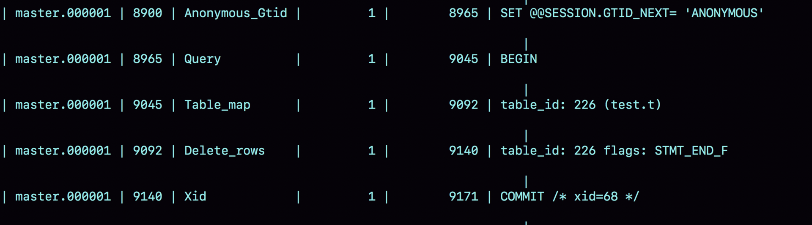

需要配合mysqlbinlog工具查看具体内容

```
mysqlbinlog  -vv data/master.000001 --start-position=8900;
```
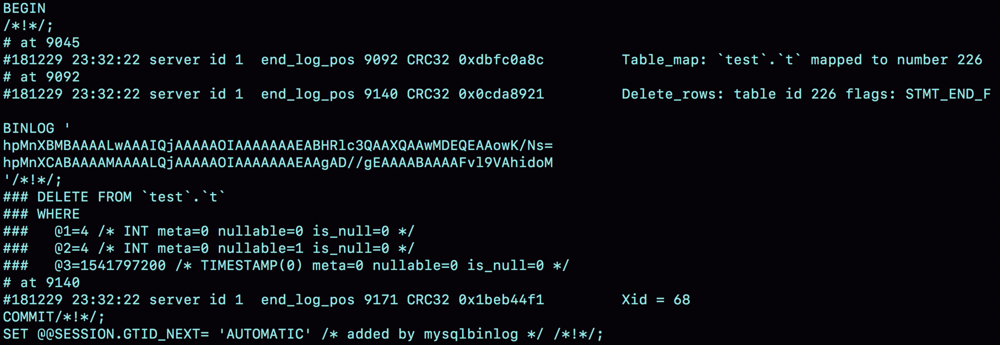

有如下信息
* server id 1，表示这个事务是在server_id=1的实例上执行的
* 每个event有CRC32值
* Table_map event表示接下来要打开的表，map到数字226
* @1=4，@2=4表示字段的值

binlog_format=mix，MySQL会判断SQL语句是否可能引起主备不一致，如果有可能则使用row格式，否则使用statement格式。既利用了statement格式省空间的优点，又避免了数据不一致的风险

基于row格式的binlog做数据回滚
* delete回滚：将delete改为insert
* insert回滚：将insert改为delete
* update回滚：binlog会记录修改前和修改后的整行数据，将两行信息对调，再去数据库执行就能恢复

binlog_format=mix的情况下，以下语句也是使用statement格式
```
mysql> insert into t values(10,10, now());
```

使用mysqlbinlog查看
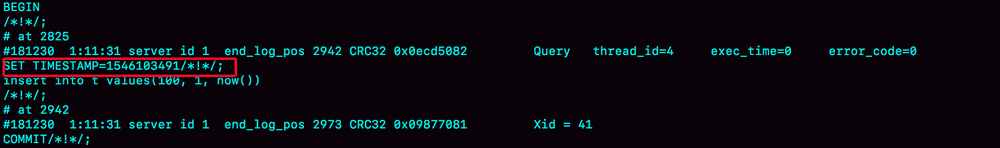
binlog 在记录 event 的时候，多记了一条命令：SET TIMESTAMP=1546103491。它用 SET TIMESTAMP 命令约定了接下来的 now() 函数的返回时间。因此，不论这个 binlog 是 1 分钟之后被备库执行，还是 3 天后用来恢复这个库的备份，这个 insert 语句插入的行，值都是固定的。也就是说，通过这条 SET TIMESTAMP 命令，MySQL 就确保了主备数据的一致性

重放binlog数据的时候，不能直接将语句拷贝出来执行，因为有些语句的执行结果是依赖于上下文的，应该使用mysqlbinlog 工具解析出来，然后把解析结果整个发给 MySQL 执行。类似下面的命令：

```
mysqlbinlog master.000001  --start-position=2738 --stop-position=2973 | mysql -h127.0.0.1 -P13000 -u$user -p$pwd;
```

MySQL可以设置双Master结构，即A和B互为主备，这种情况下需要解决循环赋值的问题
1. client从A更新的事务，binlog里记录的是A的server id
2. A将binlog传给B，B生成的server id也是A的server id
3. B将binlog传给A，A判断server id和自己的一样，不进行处理

从库和主库的同步延时，包括binlog同步的网络延时，和从库执行事务的耗时，`show slave status`命令返回结果里的seconds_behind_master字段表示备库延时了多少秒。从库在连上主库时会执行`SELECT UNIX_TIMESTAMP()`来获取当前主库时间，算出和自己本地时间点差值，在计算seconds_behind_master时会扣掉这个差值

#### 导致主备延迟的原因
1. 从库机器比主库性能差
2. 从库压力大，比如进行大量查询操作
3. 大事务，如一次性delete太多数据，或大表的DDL操作

#### 主备切换不同策略
可靠性优先：等待备库的seconds_behind_master值低于某个阈值，将主库改为只读，再等待备库的seconds_behind_master变为0，将备库改为读写。等待seconds_behind_master变为0的期间，系统处于不可写状态
可用性优先：不等数据同步，直接将备库改为可读写，可能出现数据不一致的问题。如在主库A执行Q1，同步到备库B还没来得及执行，发生主备切换，在备库执行Q2，Q2又会同步到A执行，这样A的执行顺序是Q1，Q2，B的执行顺序是Q2，Q1

#### 并行复制
基本原理：可以并行执行的事务，分配给不同的worker执行，增加执行并发度

MariaDB 的并行复制策略

redo log组提交里的事务，一定不会修改同一行，因此可以并发执行。在一组里面一起提交的事务，有一个相同的 commit_id，下一组就是 commit_id+1；commit_id 直接写到 binlog 里面；传到备库应用的时候，相同 commit_id 的事务分发到多个 worker 执行

5.7.22版本实现

通过参数binlog-transaction-dependency-tracking控制

1. COMMIT_ORDER，根据同时进入prepare和commit来判断是否可以并行（同时进入prepare的事务就已经通过了锁冲突检测）
2. WRITESET，表示的是对于事务涉及更新的每一行，计算出这一行的 hash 值，组成集合 writeset。如果两个事务没有操作相同的行，也就是说它们的 writeset 没有交集，就可以并行
3. WRITESET_SESSION，是在 WRITESET 的基础上多了一个约束，即在主库上同一个线程先后执行的两个事务，在备库执行的时候，要保证相同的先后顺序


#### 基于点位的主备切换
假设有主库A，备库A'，从库B，A和A'互为主备，B先从A同步数据，当A发生故障，A'成为主库，此时B要切换为从A'同步数据，由于A和A'上的数据并不实时同步，因此B从A'同步数据时需要指定同步点位才能保证数据不丢失

同步时执行change master命令
```
CHANGE MASTER TO 
MASTER_HOST=$host_name 
MASTER_PORT=$port 
MASTER_USER=$user_name 
MASTER_PASSWORD=$password 
MASTER_LOG_FILE=$master_log_name 
MASTER_LOG_POS=$master_log_pos  
```

最后两个参数 MASTER_LOG_FILE 和 MASTER_LOG_POS 表示，要从主库的 master_log_name 文件的 master_log_pos 这个位置的日志继续同步。而这个位置就是我们所说的同步位点，也就是主库对应的文件名和日志偏移量

寻找同步点位的粗略做法
1. 等待新主库 A’把中转日志（relay log）全部同步完成
2. 在 A’上执行 show master status 命令，得到当前 A’上最新的 File 和 Position
3. 取原主库 A 故障的时刻 T
4. 用 mysqlbinlog 工具解析 A’的 File，得到 T 时刻的位点。
    ```
    mysqlbinlog File --stop-datetime=T --start-datetime=T
    ```
    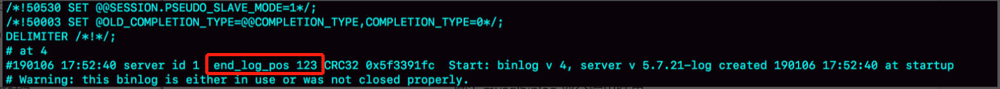
    
    图中，end_log_pos 后面的值“123”，表示的就是 A’这个实例，在 T 时刻写入新的 binlog 的位置
    
这样得到的位点并不准确，可能T时刻之后的数据已经同步到了从库，从库如果再从T时刻对应的位点去向A'同步，就会得到重复度数据，可能报错导致停止同步。可以采取主动跳过错误的方式

主动跳过一个事务
```
set global sql_slave_skip_counter=1;
start slave;
```

设置 slave_skip_errors 参数，直接设置跳过指定的错误
在执行主备切换时，有这么两类错误，是经常会遇到的：
* 1062 错误是插入数据时唯一键冲突
* 1032 错误是删除数据时找不到行

因此，我们可以把 slave_skip_errors 设置为 “1032,1062”，这样中间碰到这两个错误时就直接跳过。前提是知道跳过这两个错误是无损的，同步完后还要恢复设置为空

#### GTID
事务提交的时候会生成全局GTID（Global Transaction Identifier），格式如下
```
GTID=server_uuid:gno
```
* server_uuid是一个实例第一次启动时自动生成的，是一个全局唯一的值
* gno是一个整数，初始值是1，每次提交事务的时候分配给这个事务，并加1。注意和事务id区分，事务id是在事务执行过程中分配的，即便事务回滚了，事务id也会递增，而这里的gno是在事务提交的时候才会分配

启动GTID：加上参数 gtid_mode=on 和 enforce_gtid_consistency=on

在GTID模式下，每个事务会跟一个GTID一一对应，生成GTID有两种方式，取决于session的gtid_next值

1. gtid_next=automatic，表示使用默认值，此时MySQL会把当前server_uuid:gno分配给这个事务，记录binlog时会先记录一行`SET @@SESSION.GTID_NEXT=‘server_uuid:gno`，并把这个GTID加入本实例的GTID集合
2. gtid_next指定为特定值，比如通过set gtid_next='current_gtid’指定为 current_gtid，那么就有两种可能
    a. 如果 current_gtid 已经存在于实例的 GTID 集合中，接下来执行的这个事务会直接被系统忽略
    b. 如果 current_gtid 没有存在于实例的 GTID 集合中，就将这个 current_gtid 分配给接下来要执行的事务，也就是说系统不需要给这个事务生成新的 GTID，因此 gno 也不用加 1
    
注意，一个 current_gtid 只能给一个事务使用。这个事务提交后，如果要执行下一个事务，就要执行 set 命令，把 gtid_next 设置成另外一个 gtid 或者 automatic。这样，每个 MySQL 实例都维护了一个 GTID 集合，用来对应“这个实例执行过的所有事务”

GTID举例
假设在实例X创建如下表
```
CREATE TABLE `t` (
  `id` int(11) NOT NULL,
  `c` int(11) DEFAULT NULL,
  PRIMARY KEY (`id`)
) ENGINE=InnoDB;

insert into t values(1,1);
```

则binlog中信息如下，记录了两条GTID信息
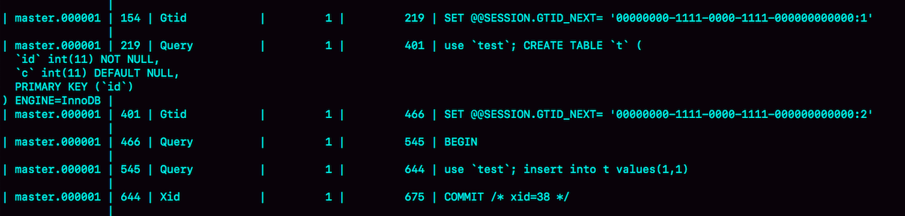

假设，现在这个实例 X 是另外一个实例 Y 的从库，并且此时在实例 Y 上执行了下面这条插入语句
```
insert into t values(1,1);
```
这条语句在实例 Y 上的 GTID 是 “aaaaaaaa-cccc-dddd-eeee-ffffffffffff:10”。如果直接同步会出现主键冲突报错，导致同步失败，可按如下方式处理

```
set gtid_next='aaaaaaaa-cccc-dddd-eeee-ffffffffffff:10';
begin;
commit;
set gtid_next=automatic;
start slave;
```
前三条语句的作用，是通过提交一个空事务，把这个 GTID 加到实例 X 的 GTID 集合中，如下
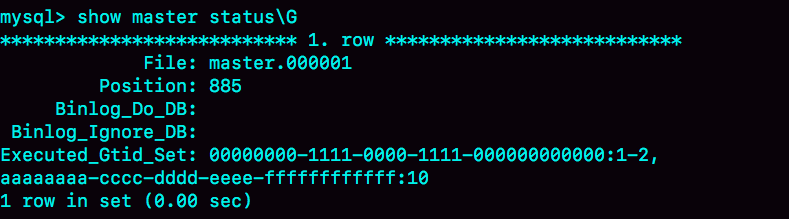

这样执行start slave的时候，虽然实例X还是会执行Y同步过来的事务，但是会跳过GTID为aaaaaaaa-cccc-dddd-eeee-ffffffffffff:10的事务，就不会出现主键冲突错误了

#### 基于GTID的主备切换
语法如下
```
CHANGE MASTER TO 
MASTER_HOST=$host_name 
MASTER_PORT=$port 
MASTER_USER=$user_name 
MASTER_PASSWORD=$password 
master_auto_position=1 
```
master_auto_position=1 就表示这个主备关系使用的是 GTID 协议。在实例B上执行start slave命令，取binlog逻辑如下
1. 实例B指定新的主库A'，基于主备协议建立连接
2. 实例B把自己的GTID集合set_b发送给A'
3. 实例A'算出自己GTID集合set_a和B传过来的set_b的差集，即存在于set_a但不存在与set_b中的GTID集合，判断是否包含这个差集需要的所有binlog事务
    a. 如果不包含，表示A'已经把B需要的binlog给删掉了，直接返回错误
    b. 如果确认全部包含，A'从自己的binlog文件里，找出差集中第一个事务，发送给B，之后就从这个事务开始，往后读文件，按顺序取binlog发送给B

#### 过期读处理方式
在读写分离场景下，往主库写入数据，在从库读数据，由于存在同步延时，可能会读不到数据，这种称为『过期读』，解决过期读有一下思路

1. 强制走主库
2. sleep方案，写完主库之后sleep一段时间在读从库
3. 判断主备无延迟，这种方式只能判断同步到备库的日志执行完成，可能还有没有同步过来的数据
    1. 判show slave status里的seconds_behind_master是否为0，单位为秒，精度不是很高
    2. 对比点位，Master_Log_File 和 Read_Master_Log_Pos，表示的是读到的主库的最新位点，Relay_Master_Log_File 和 Exec_Master_Log_Pos，表示的是备库执行的最新位点，如果两组值一致则表示日志同步完成
    3. 对比GTID集合，Retrieved_Gtid_Set，是备库收到的所有日志的 GTID 集合，Executed_Gtid_Set，是备库所有已经执行完成的 GTID 集合，如果两个集合相同，表示备库收到的日志都已经同步完成
4. semi-sync replication，主库把binlog发送给从库，需要等ack，收到ack后才能给客户端返回『事务完成』的确认。存在以下问题：
    1. 如果有多个从库，只会等一个ack，从其它从库读取仍旧过期；
    2. 写入量大多时候，延迟可能一直产生
5. 等主库点位，在主库执行的事务，只需要等改事务同步到从库，即可从从库读取，而无需等待主备完全同步。可在从库执行以下语句
    ```
    select master_pos_wait(file, pos[, timeout]);
    ```
    参数 file 和 pos 指的是主库上的文件名和位置；timeout 可选，设置为正整数 N 表示这个函数最多等待 N 秒。这个命令正常返回的结果是一个正整数 M，表示从命令开始执行，到应用完 file 和 pos 表示的 binlog 位置，执行了多少事务，其它返回结果含义
    1. 如果执行期间，备库同步线程发生异常，则返回 NULL；
    2. 如果等待超过 N 秒，就返回 -1；
    3. 如果刚开始执行的时候，就发现已经执行过这个位置了，则返回 0
    
    在主库写入一个事务后，要保证在从库查到正确数据，可以使用以下逻辑
    1. 事务更新完成后，马上执行show master status 得到当前主库执行到的 File 和 Position
    2. 选定一个从库执行查询语句
    3. 在从库上执行select master_pos_wait(File, Position, 1)
    4. 如果返回值>=0，则在这个从库执行查询语句
    5. 否则到主库执行查询语句
6. 等待GTID，思路和等主库点位类似，语句为
    ```
    select wait_for_executed_gtid_set(gtid_set, 1)
    ```
    这条语句的逻辑是：
    1. 等待，直到这个库执行的事务中包含传入的 gtid_set，返回 0
    2. 超时返回1
    
    执行事务后获取GTID分方法：
    将参数 session_track_gtids 设置为 OWN_GTID，然后通过 API 接口 mysql_session_track_get_first 从返回包解析出 GTID 的值即可
    
#### 判断数据库是否正常
1. select 1
    只能判断进程是否还在，不能说明库没有问题
    
    设置innodb_thread_concurrency可以控制InnoDB并发查询线程上线，对于正在等锁的线程是不会算在并发数里的，只有在执行查询的线程才算
    
    如果并发数达到上限，`select 1`返回正常，但是`select * from t`就会阻塞
    
2. 执行更新操作
    创建一个专门做健康检查都表，执行更新语句
    ```
    update mysql.health_check set t_modified=now();
    ```
    对于双Master的结构，可以加上server_id做主键，避免在两个master执行更新冲突
    ```
    insert into mysql.health_check(id, t_modified) values (@@server_id, now()) on duplicate key update t_modified=now();
    ```
3. 检测每个操作的耗时
    MySQL 5.6版本以后提供了performance_schema.file_summary_by_event_name表里统计了每次IO请求时间，格式如下
    
    图中统计的是redo log的写入时间  
    第一列EVENT_NAME表示统计类型  
    第一组五列，是所有IO类型的统计，COUNT_STAR是所有IO的总次数，接下来四列是具体统计项，单位上皮秒  
    第二组六列，是读操作的统计，最后一列SUM_NUMBER_OF_BYTES_READ统计的是总统从redo log里读了多少字节  
    第三组六列，是写操作的统计  
    第四组数据，是对其它类型统计，在redo log里，可以认为是对fsync的统计
    
    在performance_schema.file_summary_by_event_name表中，binlog对应的是event_name = "wait/io/file/sql/binlog"这一行，各个字段统计逻辑和redo log类似
    
    开启所有performance_schema项，性能会下降10%左右。开启redo log时间监控，执行如下语句
    ```
    mysql> update setup_instruments set ENABLED='YES', Timed='YES' where name like '%wait/io/file/innodb/innodb_log_file%';
    ```
    
    可以通过 MAX_TIMER 的值来判断数据库是否出问题了，比如设定阈值，单次IO请求时间超过200ms属于异常，用类似下面语句作为检测逻辑
    ```
    mysql> select event_name,MAX_TIMER_WAIT  FROM performance_schema.file_summary_by_event_name where event_name in ('wait/io/file/innodb/innodb_log_file','wait/io/file/sql/binlog') and MAX_TIMER_WAIT>200*1000000000;
    ```
    发现异常后，取到需要的信息，再通过以下语句把之前的统计信息清空
    ```
    mysql> truncate table performance_schema.file_summary_by_event_name;
    ```
    
#### 锁

基于以下表讨论
```
CREATE TABLE `t` (
  `id` int(11) NOT NULL,
  `c` int(11) DEFAULT NULL,
  `d` int(11) DEFAULT NULL,
  PRIMARY KEY (`id`),
  KEY `c` (`c`)
) ENGINE=InnoDB;

insert into t values(0,0,0),(5,5,5),
(10,10,10),(15,15,15),(20,20,20),(25,25,25);
```

**不等号条件里的等值查询**

```
begin;
select * from t where id>9 and id<12 order by id desc for update;
```
在执行过程中，通过树搜索的方式定位记录的时候，用的是等值查询的方法。如查询`id<12`就是要找到id=12的这个值，如果最终没找到，则会锁住对应的间隙

**等值查询的过程**

加锁是在执行过程中一个一个加的，而不是一次性过加的

以下语句分别加id=5, id=20, id=10对应的锁
```
begin;
select id from t where c in(5,20,10) lock in share mode;
```

以下语句分别加id=20, id=10, id=5对应的锁
```
select id from t where c in(5,20,10) order by c desc for update;
```

以上两条语句同时执行会发生死锁

**怎么看死锁**

执行 show engine innodb status，有一节 LATESTDETECTED DEADLOCK，就是记录的最后一次死锁信息

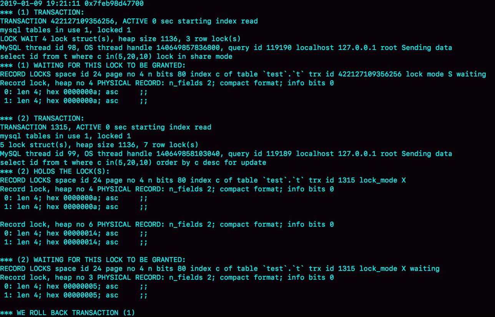


1. 这个结果分成三部分：
    * (1) TRANSACTION，是第一个事务的信息；
    * (2) TRANSACTION，是第二个事务的信息；
    * WE ROLL BACK TRANSACTION (1)，是最终的处理结果，表示回滚了第一个事务。
2. 第一个事务的信息：
    * WAITING FOR THIS LOCK TO BE GRANTED，表示的是这个事务在等待的锁信息；
    * index c of table `test`.`t`，说明在等的是表 t 的索引 c 上面的锁；
    * lock mode S waiting 表示这个语句要自己加一个读锁，当前的状态是等待中；
    * Record lock 说明这是一个记录锁；
    * n_fields 2 表示这个记录是两列，也就是字段 c 和主键字段 id；
    * 0: len 4; hex 0000000a; asc ;; 是第一个字段，也就是 c。值是十六进制 a，也就是 10；
    * 1: len 4; hex 0000000a; asc ;; 是第二个字段，也就是主键 id，值也是 10；
    * 这两行里面的 asc 表示的是，接下来要打印出值里面的“可打印字符”，但 10 不是可打印字符，因此就显示空格。
    * 第一个事务信息就只显示出了等锁的状态，在等待 (c=10,id=10) 这一行的锁。
3. 第二个事务的信息：
    * “ HOLDS THE LOCK(S)”用来显示这个事务持有哪些锁；
    * index c of table `test`.`t` 表示锁是在表 t 的索引 c 上；
    * hex 0000000a 和 hex 00000014 表示这个事务持有 c=10 和 c=20 这两个记录锁；
    * WAITING FOR THIS LOCK TO BE GRANTED，表示在等 (c=5,id=5) 这个记录锁。

**间隙锁**

间隙锁是由『这个间隙右边的那个记录』定义的，如间隙锁(10, 15)，当记录10被删除后，间隙锁会扩大为(5,15)

空表也有间隙，范围为(-∞, supremum]

#### 误删数据的恢复
**误删行**

可以使用Flashback工具恢复数据，前提是binlog_format=row和binlog_row_image=FULL

恢复方式：  
1. 对于insert语句，对应的 binlog event 类型是 Write_rows event，把它改成 Delete_rows event 即可；
2. 对于delete语句，也是将 Delete_rows event 改为 Write_rows event；
3. 对于update语句，binlog 里面记录了数据行修改前和修改后的值，对调这两行的位置即可。

如果误操作有多个，则按操作相反的顺序来恢复

预防误删可以设置sql_safe_updates参数为on，这样如果忘记在 delete 或者 update 语句中写 where 条件，或者 where 条件里面没有包含索引字段的话，这条语句的执行就会报错

**误删库/表**

使用全量备份加增量日志的方式恢复

比如中午12点误删一个库，最近的备份是当天0点，则恢复流程为

1. 用0点的备份恢复出一个临时库
2. 从日志备份里，去除凌晨0点之后的日志
3. 把这些日志，除了误删除数据的语句外，全部应用到临时库

为了加快恢复，可以在使用mysqlbinlog命令的时候，加上--datebase参数，用来指定误删表所在的库，避免恢复数据时还要应用其它库的日志

在应用日志要跳过误操作的那个语句的binlog，有两种方式

1. 如果没有使用GTID模式，先用--stop-position参数执行到误操作之前的日志，然后再用--start-position从误操作之后的日志继续执行
2. 如果使用了GTID模式，假设误操作命令的GITD为gtid1，则只需要执行set gtid_next=gtid1;begin;commit;先把这个GTID加到临时实例的GTID集合，之后按顺序执行binlog的时候，就会自动跳过误操作的语句

**延迟复制备库**

通过 CHANGE MASTER TO MASTER_DELAY = N 命令，可以指定这个备库持续保持跟主库有 N 秒的延迟。发现误操作后，先执行stop slave，再通过前面介绍的跳过误操作命令的方法，就可以恢复出需要的数据

**预防误删除库/表的方法**

1. 账号分离，只给业务开发同学DML权限，而不给truncate/drop权限
2. 指定操作规范，如删除表之前，必须先对表做改名，观察一段时间，确保对业务无影响以后再删除这张表

**rm删除数据**

对于高可用机制的MySQL集群，如果只是删除一个节点的数据，HA系统就会开始工作，选出一个新的主库，这时只需要在这个节点上把数据恢复回来，再接入整个集群

#### Kill

kill命令有两种
* kill query <thread_id>
* kill connection <thread_id>, connection可以省略

执行kill query thread_id_B，MySQL里处理kill命令的线程做了两件事
1. 把session B的运行状态改成THD::KILL_QUERY
2. 给session B的执行线程发一个信号


发信号是为了让session B退出等待，来处理THD::KILL_QUERY状态

1. 一个语句执行过程中有多处“埋点”，在这些“埋点”的地方判断线程状态，如果发现线程状态是 THD::KILL_QUERY，才开始进入语句终止逻辑；
2. 如果处于等待状态，必须是一个可以被唤醒的等待，否则根本不会执行到“埋点”处；
3. 语句从开始进入终止逻辑，到终止逻辑完全完成，是有一个过程的。

kill不掉的例子如下，设置set global innodb_thread_concurrency=2，执行下面的序列


kill query C无法终止线程，kill C会终止连接，但是这时候，如果在 session E 中执行 show processlist，能看到下面这个图


被kill的线程Command列显示Killed，连接虽然断开了，但是语句还在执行，因为此时被kill的线程处于等待进入InnoDB的循环过程中，没有机会去判断线程的状态，因此不会进入终止逻辑阶段

执行kill connection命令时
1. 把线程状态设置为KILL_CONNECTION
2. 关掉线程的网络连接

执行show processlist的时候，如果一个线程的状态是KILL_CONNECTION，就把Command列显示成Killed

kill无效的场景
1. 线程没有执行到判断线程状态的逻辑
2. 终止逻辑耗时较长
    1. 超大事务执行期间被kill，回滚耗时较长
    2. 大查询回滚，如果查询过程中生成比较大的临时文件，加上此时文件系统压力大，删除临时文件耗时较长
    3. DDL命令执行到最后阶段被kill，需要删除中间过程的临时文件，可能受IO资源影响耗时较长
    
数据库表特别多，客户端连接可能很慢，如


这是因为MySQL客户端会提供一个本地库名和表名的补全功能，客户端连接成功后，需要多做一些操作
1. 执行show database
2. 切换到db1库，执行show tables
3. 把这两个命令的结果用于构建一个本地的哈希表

当库中断表比较多时，第三步耗时较长。可以通过添加-A命令关掉补全功能

MySQL 客户端发送请求后，接收服务端返回结果的方式有两种：
1. 一种是本地缓存，也就是在本地开一片内存，先把结果存起来。如果你用 API 开发，对应的就是 mysql_store_result 方法。
2. 另一种是不缓存，读一个处理一个。如果你用 API 开发，对应的就是 mysql_use_result 方法。

客户端使用--quic选项可能会降低服务端性能，主要有以下三点效果

1. 跳过表名自动补全功能
2. 不使用本地缓存，减少客户端本地机器的性能开销
3. 不会把执行命令记录到本地的命令历史文件

#### 全表扫描
服务端流程：
1. 获取一行，写到 net_buffer 中。这块内存的大小是由参数 net_buffer_length 定义的，默认是 16k。
2. 重复获取行，直到 net_buffer 写满，调用网络接口发出去。
3. 如果发送成功，就清空 net_buffer，然后继续取下一行，并写入 net_buffer。
4. 如果发送函数返回 EAGAIN 或 WSAEWOULDBLOCK，就表示本地网络栈（socket send buffer）写满了，进入等待。直到网络栈重新可写，再继续发送

全表扫描对服务端内存开销不大

show processlist看到 State 的值一直处于“Sending to client”，就表示服务器端的网络栈写满了


“Sending data”状态并不一定是指“正在发送数据”，而可能是处于执行器过程中的任意阶段

查询时如果内存数据页是最新的，则直接读取内存数据，因此Buffer Pool可以提高查询速度。InnoDB Buffer Pool 的大小是由参数 innodb_buffer_pool_size 确定的，一般建议设置成可用物理内存的 60%~80%

执行 show engine innodb status ，可以看到“Buffer pool hit rate”字样，显示的就是当前的命中率。一般情况下，一个稳定服务的线上系统，要保证响应时间符合要求的话，内存命中率要在 99% 以上


内存管理使用LRU算法，分old和young区

1. 第一次被访问的数据，先进入old区
2. 在old区存在时间超过1秒，进入young区头部，否则保持不变

这样对大表进行全表扫描时，只会影响old区，可以保证Buffer Pool的内存命中率

#### join
表结构
```
CREATE TABLE `t2` (
  `id` int(11) NOT NULL,
  `a` int(11) DEFAULT NULL,
  `b` int(11) DEFAULT NULL,
  PRIMARY KEY (`id`),
  KEY `a` (`a`)
) ENGINE=InnoDB;

drop procedure idata;
delimiter ;;
create procedure idata()
begin
  declare i int;
  set i=1;
  while(i<=1000)do
    insert into t2 values(i, i, i);
    set i=i+1;
  end while;
end;;
delimiter ;
call idata();

create table t1 like t2;
insert into t1 (select * from t2 where id<=100)
```

**Index Nested-Loop Join**

被驱动表有索引，对驱动表t1做全表扫描，对被驱动表t2做树搜索过程

```
select * from t1 straight_join t2 on (t1.a=t2.a);
```

1. 从表t1读入一行数据R
2. 从数据行R中读取a字段到表t2里查找
3. 取出表t2中满足条件的行，跟R组成一行，作为结果集的一部分
4. 重复执行步骤1到3，知道表t1的末尾循环结束

**Simple Nested-Loop Join**

被驱动表没有索引，对驱动表做全表扫描，每次到t2去匹配时，也要做全表扫描

```
select * from t1 straight_join t2 on (t1.a=t2.b);
```

**Block Nested-Loop Join**

被驱动表没有索引，使用join_buffer存储驱动表数据，join_buffer大小由join_buffer_size设定，默认值是256k

```
select * from t1 straight_join t2 on (t1.a=t2.b);
```

1. 扫描表t1，顺序读取数据行放入join_buffer中，若表t1全部放入join_buffer或join_buffer满了，则执行第二步
2. 扫描表t2，取出每一行跟join_buffer中的数据做对比，满足join条件，作为结果集的一部分返回
3. 若t1已全部放入join_buffer则结束，否则清空join_buffer，继续执行第一步

和join_buffer的数据做对比是内存操作，比Simple Nested-Loop Join效率要高

选择驱动表的原则：选择小表作为驱动。两个表按照各自的条件过滤，过滤完成后，计算参与join的各个字段的总数据量，数据量小的表就是小表，应该作为驱动表

#### join优化

**Multi-Range Read 优化**

按主键递增顺序查询，对磁盘读接近顺序读，能提升读性能

MRR优化流程：
1. 定位到满足条件的记录，将主键放入read_rnd_buffer中
2. 将read_rnd_buffer中的主键进行递增排序
3. 排序后的主键数组，依次到主键索引中查记录，并作为结果返回

read_rnd_buffer 的大小由 read_rnd_buffer_size 参数控制。如果步骤1的read_rnd_buffer 放满了，就会先执行完步骤 2 和 3，然后清空 read_rnd_buffer，继续循环

使用MRR优化，需要设置`set optimizer_switch="mrr_cost_based=off"`，explain结果如下

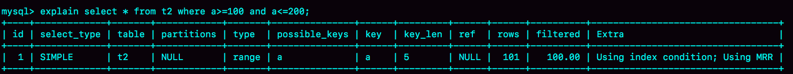

MRR 能够提升性能的核心在于，查询语句在索引上做的是一个范围查询（也就是说，这是一个多值查询），可以得到足够多的主键。这样通过排序以后，再去主键索引查数据，才能体现出“顺序性”的优势

**Batched Key Access**

NLJ 算法执行的逻辑是：从驱动表 t1，一行行地取出 a 的值，再到被驱动表 t2 去做 join。也就是说，对于表 t2 来说，每次都是匹配一个值，MRR 的优势就用不上

NLJ 算法优化后的 BKA 算法的流程为

1. 从驱动表t1批量取出数据，放入join_buffer
2. 将join_buffer里的数据批量传给被驱动表t2
3. 循环步骤1和2，知道驱动表t1的数据处理完成

开启BKA算法需要设置`set optimizer_switch='mrr=on,mrr_cost_based=off,batched_key_access=on';`

**BNL 算法的性能问题**

由于会对被驱动表做多次扫描，会对Buffer Poll造成影响

1. 被驱动表较小，old区能放下，由于扫描多次，扫描间隔超过1秒，会进入young区，影响young区缓存命中率
2. 被驱动表较大，old区放不下，会反复在old区淘汰，导致old区的正常业务数据没有机会进入young区

优化思路

1. 增大 join_buffer_size 的值，减少对被驱动表的扫描次数
2. 给被驱动表的 join 字段加上索引，把 BNL 算法转成 BKA 算法

**BNL 转 BKA**

一些情况下，我们可以直接在被驱动表上建索引，这时就可以直接转成 BKA 算法，也有一些不适合的，比如

```
select * from t1 join t2 on (t1.b=t2.b) where t2.b>=1 and t2.b<=2000;
```

其中t2有100W行数据，但是经过where条件过滤只剩2000行，t1有1000行数据。使用BNL算法会对t2做多次遍历，在t2上建索引又比较浪费，此时可以使用临时表的方式

1. 把表 t2 中满足条件的数据放在临时表 tmp_t 中；
2. 为了让 join 使用 BKA 算法，给临时表 tmp_t 的字段 b 加上索引；
3. 让表 t1 和 tmp_t 做 join 操作。

**hash join**

业务自己实现，将两个表的数据取到内存，建立hash表再查找

#### 临时表
**临时表特点**

1. 建表语法`create temporary table`
2. 只能被创建它的session访问，对其它线程不可见，session结束自动删除
3. 临时表可以与普通表重名
4. session内有同名的临时表和普通表时，show create语句以及增删改查语句访问的是临时表
5. show tables命令不显示临时表

**临时表应用**

如果一个查询需要查多个分库再汇总，可以先创建临时表，在各个分库查到结果，插入临时表，再在临时表上进行查询

**临时表命名**

临时表的磁盘文件命名格式为`#sql{进程 id}_{线程 id}_ 序列号.frm`

内存里面也有一套机制区别不同的表，每个表都对应一个 table_def_key，普通表的table_ref_key点值是由"库名+表名"得到，而临时表在这个基础上，又加入了"server_id+thread_id"

每个线程维护了自己的临时表链表，操作表的时候，先遍历链表，如果匹配到临时表，就优先操作临时表，如果没有再操作普通表，session结束的时候，对链表里的每个临时表执行"DROP TEMPORARY TABLE + 表名”操作

**临时表的主备复制**

在 binlog_format=row的时候，临时表的操作不记录到 binlog 中，只在 binlog_format=statment/mixed 的时候，binlog 中才会记录临时表的操作

主库两个不同session创建同名临时表，记录binlog的时候，会把执行语句的线程id写到binlog中，这样备库的应用线程在创建临时表的时候就不会冲突

**内部临时表**

union操作

```
(select 1000 as f) union (select id from t1 order by id desc limit 2);
```

1. 创建内存临时表
2. 执行第一个查询，将结果放入临时表
3. 执行第二个查询，将结果放入临时表
4. 从临时表取出结果，删除临时表

group by

```
select id%10 as m, count(*) as c from t1 group by m;
```

1. 创建内存临时表，表里有两个字段 m 和 c，主键是 m；
2. 扫描表 t1 的索引，依次取出叶子节点上的 id 值，计算 id%10 的结果，记为 x；
    1. 如果临时表中没有主键为 x 的行，就插入一个记录 (x,1);
    2. 如果表中有主键为 x 的行，就将 x 这一行的 c 值加 1；
3. 遍历完成后，再根据字段 m 做排序，得到结果集返回给客户端。

如果不用排序，改成

```
select id%10 as m, count(*) as c from t1 group by m order by null;
```

就会跳过最后的排序阶段

内存临时表的内存大小由tmp_table_size设置，超过上限后就会把内存临时表转成磁盘临时表，磁盘临时表默认使用InnoDB引擎

group by使用索引优化

如果group by的列是顺序的，就不需要使用临时表。在MySQL 5.7 版本支持了 generated column 机制，用来实现列数据的关联更新，如

```
alter table t1 add column z int generated always as(id % 100), add index(z);
```

这样语句`select id%100 as m, count(*) as c from t1 group by m order by null limit 10;`就可以改成`
select z, count(*) as c from t1 group by z;`，就可以直接使用索引了

group by使用直接排序

在 group by 语句中加入 SQL_BIG_RESULT 这个提示（hint），就可以告诉优化器：这个语句涉及的数据量很大，请直接用磁盘临时表，由于磁盘临时表是B+树存储，存储效率不如数组，索引优化器从磁盘空间考虑，会直接使用数组来存

因此以下语句

```
select SQL_BIG_RESULT id%100 as m, count(*) as c from t1 group by m;
```

执行流程为

1. 初始化 sort_buffer，确定放入一个整型字段，记为 m；
2. 扫描表 t1 的索引 a，依次取出里面的 id 值, 将 id%100 的值存入 sort_buffer 中；
3. 扫描完成后，对 sort_buffer 的字段 m 做排序（如果 sort_buffer 内存不够用，就会利用磁盘临时文件辅助排序）；
4. 排序完成后，就得到了一个有序数组
5. 根据有序数组，遍历一遍就可以得到每个值出现的次数


#### Memory引擎
临时表可以使用Memory引擎和InnoDB引擎，Memory引擎特点

1. 索引是hash结构，无序排列，不同索引地位等价。索引存的是数据的位置
2. 数据位置发生改变时，需要修改所有索引
3. 当插入数据时，只要数据块未占用即可使用，而不像InnoDB需要保证数据有序，只能在固定位置插入新值
4. 内存表不支持 Blob 和 Text 字段，并且即使定义了 varchar(N)，实际也当作 char(N)，也就是固定长度字符串来存储，因此内存表的每行数据长度相同
5. 对内存表的hash索引字段进行范围查询，需要全表扫描
6. 内存表也可以创建B-Tree索引`alter table t1 add index a_btree_index using btree (id);`，此时执行 `select * from t1 where id<5`的时候，优化器会选择B-Tree索引
7. 内存表锁粒度大，只支持表锁，不支持行锁
8. 内存表重启会清空，比如有内存表t1，数据库重启之后，会往binlog里面写入一行`DELETE FROM t1`，如果发生同步，会导致备库的内存表也被清空
9. 内存表不适合用在生产环境，在数据量小的时候，临时表可以使用内存表，有以下原因
    1. 临时表不会被其他线程访问，没有并发性的问题
    2. 临时表重启后也是需要删除的，清空数据这个问题不存在
    3. 备库的临时表也不会影响主库的用户线程
    
#### 自增主键
**保存策略**

* MyISAM引擎的自增殖保存在数据文件中
* InnoDB引擎保存在内存里，在MySQL8.0版本以后，才有了自增持久化能力
    * MySQL5.7及之前的版本，自增值保存在内存里，每次重启后，第一次打开表的时候，会找自增殖的最大值max(id)，然后将max(id)+1作为这个表当前的自增值，比如一个表当前数据行里最大的 id 是 10，AUTO_INCREMENT=11，这时候，删除 id=10 的行，AUTO_INCREMENT 还是 11，但如果马上重启实例，重启后这个表的 AUTO_INCREMENT 就会变成 10
    * 在 MySQL 8.0 版本，将自增值的变更记录在了 redo log 中，重启的时候依靠 redo log 恢复重启之前的值
    
**修改机制**

* 如果插入数据时 id 字段指定为 0、null 或未指定值，那么就把这个表当前的 AUTO_INCREMENT 值填到自增字段，AUTO_INCREMENT加1
* 如果插入数据时 id 字段指定了具体的值，就直接使用语句里指定的值，如果插入值小于等于AUTO_INCREMENT则保持不变，否则AUTO_INCREMENT设置为新插入的值加1

新的自增值生成算法是：从 auto_increment_offset 开始，以 auto_increment_increment 为步长，持续叠加，直到找到第一个大于插入的值，作为新的自增值

auto_increment_offset 和 auto_increment_increment 是两个系统参数，分别用来表示自增的初始值和步长，默认值都是 1。双 M 的主备结构里要求双写的时候，我们就可能会设置成 auto_increment_increment=2，让一个库的自增 id 都是奇数，另一个库的自增 id 都是偶数，避免两个库生成的主键发生冲突

**修改时机**

在执行语句的时候会先申请自增值，如果语句执行失败或回滚，自增值不会跟着回滚，此时自增殖就会不连续

**自增锁**

MySQL 5.1.22 版本引入了一个新策略，新增参数 innodb_autoinc_lock_mode，默认值是 1

* 设置为 0 时，表示采用之前 MySQL 5.0 版本的策略，即语句执行结束后才释放锁；
* 设置为 1 时，普通 insert 语句，自增锁在申请之后就马上释放；类似 insert … select 这样的批量插入数据的语句，自增锁还是要等语句结束后才被释放；
* 设置为 2 时，所有的申请自增主键的动作都是申请后就释放锁

默认设置下，insert … select 要使用语句级的锁而不是申请之后立马释放是为了保证数据的一致性，否则在binlog_format=statement时，如果有两条insert ... select语句在主库执行，在主库上两个语句分配的自增id可能是交叉的，而从库上执行可能是连续的

在生产上，尤其是有 insert … select，replace ... select, load data这种批量插入数据的场景时，从并发插入数据性能的角度考虑，建议这样设置：innodb_autoinc_lock_mode=2 ，并且 binlog_format=row. 这样做，既能提升并发性，又不会出现数据一致性问题

在普通的 insert 语句里面包含多个 value 值的情况下，即使 innodb_autoinc_lock_mode 设置为 1，也不会等语句执行完成才释放锁。因为这类语句在申请自增 id 的时候，是可以精确计算出需要多少个 id 的，然后一次性申请，申请完成后锁就可以释放了

对于批量插入数据的语句，MySQL 有一个批量申请自增 id 的策略：
* 语句执行过程中，第一次申请自增 id，会分配 1 个；
* 1 个用完以后，这个语句第二次申请自增 id，会分配 2 个；
* 2 个用完以后，还是这个语句，第三次申请自增 id，会分配 4 个；
* 依此类推，同一个语句去申请自增 id，每次申请到的自增 id 个数都是上一次的两倍

如果一次申请分配的id没有用完，就会被浪费掉，也会导致自增id不连续

#### insert

* insert ... select在可重复读隔离级别下，会给select的表里扫描到的记录和间隙加读锁
* insert和select的对象是同一个表，为了避免表扫描边插入导致循环写入，会先扫描全表（哪怕select语句使用了limit 1），创建临时表，再将结果写入表
* insert出现唯一键冲突时，会在冲突的唯一值上加共享的next-key lock(S锁）
* insert into … on duplicate key update 这个语义的逻辑是，插入一行数据，如果碰到唯一键约束，就执行后面的更新语句，如果有多个列违反了唯一性约束，就会按照索引对顺序，修改第一个索引冲突的行

以下情况会死锁

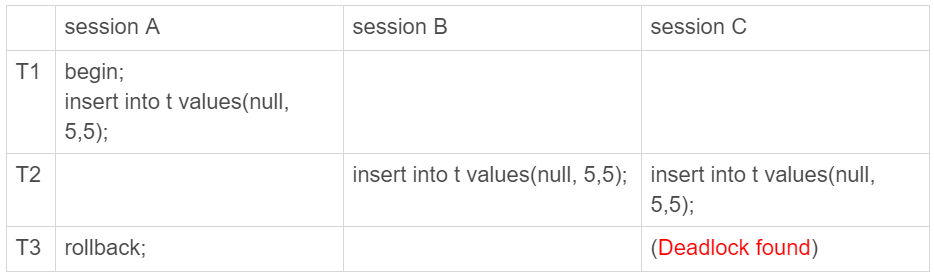

* T1时刻，session A执行insert，在索引c的c=5上加了记录锁（唯一索引，退化为记录锁）
* T2时刻，session B执行insert发现唯一键冲突，在索引c上c=5加上读锁，同理session B也加上读锁
* T3时刻，session A回滚，这时候session B和C都试图继续执行插入操作，需要加写锁，两个session都要等待对方的读锁，因此出现死锁

#### 复制表
假设，我们要把 db1.t 里面 a>900 的数据行导出来，插入到 db2.t 中

**mysqldump方法**

导出数据

```
mysqldump -h$host -P$port -u$user --add-locks=0 --no-create-info --single-transaction  --set-gtid-purged=OFF db1 t --where="a>900" --result-file=/client_tmp/t.sql
```

* `–single-transaction`: 在导出数据的时候不需要对表 db1.t 加表锁，而是使用 START TRANSACTION WITH CONSISTENT SNAPSHOT 的方法
* `–add-locks=0`: 在输出的文件结果里，不增加" LOCK TABLES t WRITE;"
* `–no-create-info`: 不需要导出表结构
* `–set-gtid-purged=off`: 不输出跟 GTID 相关的信息
* `–result-file`: 指定输出文件的路径，其中 client 表示生成的文件是在客户端机器上的。

这样生成的是一条insert语句，包含多个value对，如果想每个insert语句只包含一个value，需要加上参数`–skip-extended-insert`

导入数据

```
mysql -h$host -P$port -u$user db2 -e "source /client_tmp/t.sql"
```

source 并不是一条 SQL 语句，而是一个客户端命令。mysql 客户端执行这个命令的流程如下

1. 打开文件，默认以分号为结尾读取一条条的 SQL 语句
2. 将 SQL 语句发送到服务端执行。

**导出 CSV 文件**

导出数据

```
select * from db1.t where a>900 into outfile '/server_tmp/t.csv';
```

注意点如下：

* 导出结果保存在服务端。如果你执行命令的客户端和 MySQL 服务端不在同一个机器上，客户端机器的临时目录下是不会生成 t.csv 文件的
* into outfile 指定了文件的生成位置（/server_tmp/），这个位置必须受参数 secure_file_priv 的限制。参数 secure_file_priv 的可选值和作用分别是
    * 如果设置为 empty，表示不限制文件生成的位置，这是不安全的设置
    * 如果设置为一个表示路径的字符串，就要求生成的文件只能放在这个指定的目录，或者它的子目录
    * 如果设置为 NULL，就表示禁止在这个 MySQL 实例上执行 select … into outfile 操作
* 这条命令不会帮你覆盖文件，因此你需要确保 /server_tmp/t.csv 这个文件不存在，否则执行语句时就会因为有同名文件的存在而报错
* 这条命令生成的文本文件中，原则上一个数据行对应文本文件的一行。但是，如果字段中包含换行符，在生成的文本中也会有换行符。不过类似换行符、制表符这类符号，前面都会跟上“\”这个转义符，这样就可以跟字段之间、数据行之间的分隔符区分开

导入数据

```
load data infile '/server_tmp/t.csv' into table db2.t;
```

执行流程如下：

1. 打开文件 /server_tmp/t.csv，以制表符 (\t) 作为字段间的分隔符，以换行符（\n）作为记录之间的分隔符，进行数据读取
2. 启动事务
3. 判断每一行的字段数与表 db2.t 是否相同
    * 若不相同，则直接报错，事务回滚
    * 若相同，则构造成一行，调用 InnoDB 引擎接口，写入到表中
4. 重复步骤 3，直到 /server_tmp/t.csv 整个文件读入完成，提交事务

如果 binlog_format=statement，这条语句的同步流程为

1. 主库执行完成后，将 /server_tmp/t.csv 文件的内容直接写到 binlog 文件中
2. 往 binlog 文件中写入语句 load data local infile ‘/tmp/SQL_LOAD_MB-1-0’ INTO TABLE `db2`.`t
3. 把这个 binlog 日志传到备库
4. 备库的 apply 线程在执行这个事务日志时
    1. 先将 binlog 中 t.csv 文件的内容读出来，写入到本地临时目录 /tmp/SQL_LOAD_MB-1-0 中
    2. 再执行 load data 语句，往备库的 db2.t 表中插入跟主库相同的数据
    
备库执行的 load data 语句里面，多了一个“local”

1. 不加“local”，是读取服务端的文件，这个文件必须在 secure_file_priv 指定的目录或子目录下
2. 加上“local”，读取的是客户端的文件，只要 mysql 客户端有访问这个文件的权限即可。这时候，MySQL 客户端会先把本地文件传给服务端，然后执行上述的load data流程

binlog传到备库也是在服务端执行，添加local标识还有以下考虑

1. 防止备库配置了`secure_file_priv=null`，不加local可能导入失败
2. 使用`mysqlbinlog $binlog_file | mysql -h$host -P$port -u$user -p$pwd`语句导入，binlog增加local就可以支持非本地的`$host`

select …into outfile 方法不会生成表结构文件，mysqldump 提供了一个–tab 参数，可以同时导出表结构定义文件和 csv 数据文件

```
mysqldump -h$host -P$port -u$user ---single-transaction  --set-gtid-purged=OFF db1 t --where="a>900" --tab=$secure_file_priv
```

**物理拷贝方法**

在 MySQL 5.6 版本引入了可传输表空间(transportable tablespace) 的方法，可以通过导出 + 导入表空间的方式，实现物理拷贝表的功能

假设我们现在的目标是在 db1 库下，复制一个跟表 t 相同的表 r，具体的执行步骤如下:

1. 执行 create table r like t，创建一个相同表结构的空表
2. 执行 alter table r discard tablespace，这时候 r.ibd 文件会被删除
3. 执行 flush table t for export，这时候 db1 目录下会生成一个 t.cfg 文件
4. 在 db1 目录下执行`cp t.cfg r.cfg; cp t.ibd r.ibd`这两个命令（这里需要注意的是，拷贝得到的两个文件，MySQL 进程要有读写权限）
5. 执行 unlock tables，这时候 t.cfg 文件会被删除
6. 执行 alter table r import tablespace，将这个 r.ibd 文件作为表 r 的新的表空间，由于这个文件的数据内容和 t.ibd 是相同的，所以表 r 中就有了和表 t 相同的数据

关于拷贝表的这个流程，有以下几个注意点：
1. 在第 3 步执行完 flsuh table 命令之后，db1.t 整个表处于只读状态，直到执行 unlock tables 命令后才释放读锁；
2. 在执行 import tablespace 的时候，为了让文件里的表空间 id 和数据字典中的一致，会修改 r.ibd 的表空间 id。而这个表空间 id 存在于每一个数据页中。因此，如果是一个很大的文件（比如 TB 级别），每个数据页都需要修改，所以你会看到这个 import 语句的执行是需要一些时间的。当然，如果是相比于逻辑导入的方法，import 语句的耗时是非常短的。

#### 权限
**全局权限**

```
grant all privileges on *.* to 'ua'@'%' with grant option;
```

1. 磁盘上，将 mysql.user 表里，用户’ua’@’%'这一行的所有表示权限的字段的值都修改为‘Y’
2. 内存里，从数组 acl_users 中找到这个用户对应的对象，将 access 值（权限位）修改为二进制的“全 1”

如果有新的客户端使用用户名 ua 登录成功，MySQL 会为新连接维护一个线程对象，然后从 acl_users 数组里查到这个用户的权限，并将权限值拷贝到这个线程对象中。之后在这个连接中执行的语句，所有关于全局权限的判断，都直接使用线程对象内部保存的权限位

grant命令对于全局权限，只对新连接生效，已经存在的连接不受影响

回收语句如下

```
revoke all privileges on *.* from 'ua'@'%';
```

1. 磁盘上，将 mysql.user 表里，用户’ua’@’%'这一行的所有表示权限的字段的值都修改为“N”；
2. 内存里，从数组 acl_users 中找到这个用户对应的对象，将 access 的值修改为 0

**db权限**

```
grant all privileges on db1.* to 'ua'@'%' with grant option;
```

1. 磁盘上，往 mysql.db 表中插入了一行记录，所有权限位字段设置为“Y”；
2. 内存里，增加一个对象到数组 acl_dbs 中，这个对象的权限位为“全 1”。

每次需要判断一个用户对一个数据库读写权限的时候，都需要遍历一次 acl_dbs 数组，根据 user、host 和 db 找到匹配的对象，然后根据对象的权限位来判断

当前会话如果处于某个db里面，之前use这个库的时候拿到的库权限会保存到回话变量值中，此时修改db权限不会受影响，如果显式使用db则会受影响


**表权限和列权限**

```
create table db1.t1(id int, a int);

grant all privileges on db1.t1 to 'ua'@'%' with grant option;
GRANT SELECT(id), INSERT (id,a) ON mydb.mytbl TO 'ua'@'%' with grant option;
```

表权限定义存放在表 mysql.tables_priv 中，列权限定义存放在表 mysql.columns_priv 中。这两类权限，组合起来存放在内存的 hash 结构 column_priv_hash 中

跟db权限类似，这两个权限每次 grant 的时候都会修改数据表，也会同步修改内存中的 hash 结构。因此，对这两类权限的操作，也会马上影响到已经存在的连接

**flush privileges 使用场景**

flush privileges 命令会清空 acl_users 数组，然后从 mysql.user 表中读取数据重新加载，重新构造一个 acl_users 数组，对于 db 权限、表权限和列权限，也做了这样的处理

正常情况下，grant 命令之后，没有必要跟着执行 flush privileges 命令，只有当磁盘中的权限数据和内存中的权限数据不一致时才需要使用

这种不一致往往是由不规范的操作导致的，比如直接用 DML 语句操作系统权限表

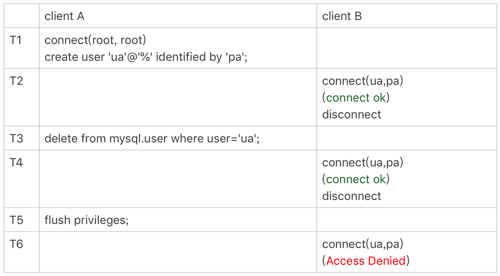


直接操作系统表是不规范的操作，这个不一致状态也会导致一些更“诡异”的现象发生。比如，前面这个通过 delete 语句删除用户的例子，就会出现下面的情况

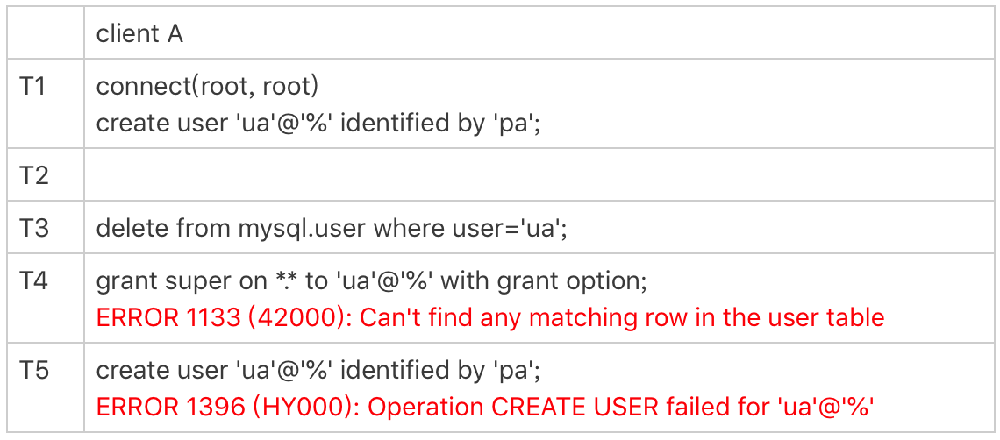

由于在 T3 时刻直接删除了数据表的记录，而内存的数据还存在。这就导致了：

1. T4 时刻给用户 ua 赋权限失败，因为 mysql.user 表中找不到这行记录
2. T5 时刻要重新创建这个用户也不行，因为在做内存判断的时候，会认为这个用户还存在。

