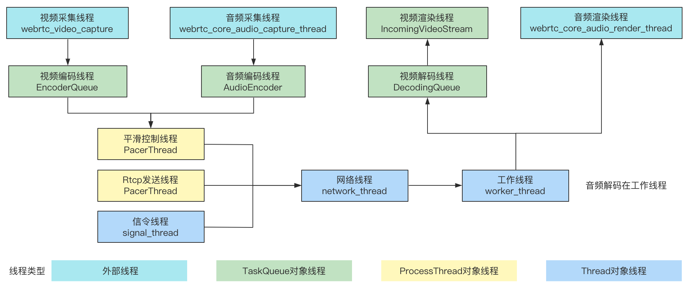

WebRTC提供了端到端的音视频通信能力，最方便的使用方式是在浏览器上使用其提供的js api，但很多时候我们也需要在移动端或PC上开发应用，WebRTC底层使用C++编码实现，具有跨平台的特性，分析其底层代码实现也有助于我们更加深入了解它的原理，本文主要介绍WebRTC C++代码的线程模型

## 整体结构
WebRTC交互包含信令控制，音视频采集，编码，传输，解码，渲染等流程，每个模块都严格运行在指定的线程中，当一个模块的任务处理完成，会通过任务队列的方式投递到相应的线程继续处理。整体线程结构如下，这里只列出了关键的线程，以Windows平台为例




## 功能说明
### 信令线程
信令线程可以在创建PeerConnectionFactoryInterface时指定，若未指定，则以调用线程作为信令线程，线程对象为Thread，传入方式如下

```cpp
struct RTC_EXPORT PeerConnectionFactoryDependencies final {

  // Optional dependencies

  rtc::Thread* network_thread = nullptr;

  rtc::Thread* worker_thread = nullptr;

  rtc::Thread* signaling_thread = nullptr;

  // ...
};

// If |network_thread| or |worker_thread| are null, the PeerConnectionFactory

// will create the necessary thread internally. If |signaling_thread| is null,

// the PeerConnectionFactory will use the thread on which this method is called

// as the signaling thread, wrapping it in an rtc::Thread object if needed.

RTC_EXPORT rtc::scoped_refptr<PeerConnectionFactoryInterface>

CreateModularPeerConnectionFactory(PeerConnectionFactoryDependencies dependencies);

```

信令主要工作在PeerConnection模块，完成sdp，candidate的获取和设置等信令控制相关的流程，PeerConnection的所有接口和回调都在信令线程执行，常见如下

* `CreateOffer` 生成sdp offer
* `CreateAnswer`  生成sdp answer
* `SetLocalDescription` 设置本地sdp
* `SetRemoteDescription` 设置远端sdp
* `AddIceCandidate` 设置candidate
* `PeerConnectionObserver`  ice状态变更，candidate获取等回调
* `CreateSessionDescriptionObserver` sdp设置和获取的回调

信令线程调用流程
```
信令线程                  
PeerConnection::CreateOffer
└── WebRtcSessionDescriptionFactory::CreateOffer
    └── WebRtcSessionDescriptionFactory::InternalCreateOffer
        └── MediaSessionDescriptionFactory::CreateOffer
            └── PostCreateSessionDescriptionSucceeded
                └── CreateSessionDescriptionObserver::OnSuccess

信令线程
PeerConnection::CreateAnswer
└── WebRtcSessionDescriptionFactory::CreateAnswer
    └── WebRtcSessionDescriptionFactory::InternalCreateAnswer
        └── MediaSessionDescriptionFactory::CreateAnswer
            └── WebRtcSessionDescriptionFactory::PostCreateSessionDescriptionSucceeded
                └── CreateSessionDescriptionObserver::OnSuccess

信令线程
PeerConnection::SetLocalDescription
├── PeerConnection::ApplyLocalDescription
│   ├── PeerConnection::PushdownTransportDescription
│   │   │   在网络线程Invoke
│   │   └── JsepTransportController::SetLocalDescription
│   └── PeerConnection::UpdateSessionState
│       └── PeerConnection::PushdownMediaDescription
│           └── BaseChannel::SetLocalContent
│               │   在work线程Invoke
│               └── BaseChannel::SetLocalContent
├── PeerConnection::PostSetSessionDescriptionSuccess
│   在work线程Invoke
└── JsepTransportController::MaybeStartGathering 
                

信令线程
PeerConnection::SetRemoteDescription
├── PeerConnection::ApplyRemoteDescription
│   ├── PeerConnection::PushdownTransportDescription
│   │   │   在网络调用
│   │   └── JsepTransportController::SetRemoteDescription
│   └── PeerConnection::UpdateSessionState
│       └── PeerConnection::PushdownMediaDescription
│           └── BaseChannel::SetRemoteContent
│               │   在work Invoke
│               └── BaseChannel::SetRemoteContent_w
└── PeerConnection::PostSetSessionDescriptionSuccess    

信令线程
PeerConnection::AddIceCandidate
├── PeerConnection::ReadyToUseRemoteCandidate
├── JsepSessionDescription::AddCandidate
└── PeerConnection::UseCandidate
    │   切换network线程
    └── JsepTransportController::AddRemoteCandidates
        └── JsepTransport::AddRemoteCandidates
            └── P2PTransportChannel::AddRemoteCandidate
                └── P2PTransportChannel::FinishAddingRemoteCandidate
                    ├──  P2PTransportChannel::CreateConnections
                    │   ├── UDPPort::CreateConnection
                    │   │   ├── 构造ProxyConnection
                    │   │   └── Port::AddOrReplaceConnection
                    │   └── P2PTransportChannel::AddConnection
                    └── P2PTransportChannel::SortConnectionsAndUpdateState
                        ├── P2PTransportChannel::UpdateConnectionStates
                        │   └── Connection::UpdateState
                        └── P2PTransportChannel::MaybeStartPinging
```

### 工作线程
由外部指定，传入方式和信令线程一样，若未指定，WebRTC内部会创建相应线程，线程对象为Thread。主要工作在媒体引擎层，负责串联整个音视频收发流程，包括

* 音视频设备初始化
* 音视频发送模块创建
* 从网络线程接收数据，传递给解码线程
* 从编码线程接收数据，传递给网络线程


创建工厂对象
```
主线程
CreatePeerConnectionFactory
├── 传入如下对象
│   信令线程、工作线程、网络线程
│   AudioEncoderFactory
│   AudioDecoderFactory
│   VideoEncoderFactory
│   VideoDecoderFactory
├── CreateDefaultTaskQueueFactory
│   └── 创建TaskQueueFactory
├── CreateCallFactory
│   └── 创建CallFactory
└── CreateMediaEngine
    ├── 创建WebRtcVoiceEngine
    ├── 创建WebRtcVideoEngine
    └── 创建CompositeMediaEngine，管理audio_engine和video_engine
```
初始化媒体
```
信令线程
PeerConnectionFactory::Initialize
├── 构造ChannelManager
└── ChannelManager::Init
    │   以下模块在work线程调用
    └── CompositeMediaEngine::Init
        └── WebRtcVoiceEngine::Init
            ├── WebRtcVoiceEngine::CollectCodecs // 获取音频编码类型
            │   AudioDeviceModule::Create // 若未指定，则创建adm
            │   └── AudioDeviceModule::CreateForTest
            │        └── AudioDeviceModuleImpl::AudioDeviceModuleImpl 
            ├── webrtc::adm_helpers::init // 初始化AudioDeviceModule
            ├── webrtc::apm_helpers::Init // 初始化AudioProcessing
            ├── AudioMixerImpl::Create // 若未指定，则创建AudioMixer
            ├── AudioState::Create
            │   └── AudioTransportImpl::AudioTransportImpl // 创建AudioTransport
            └── AudioDeviceModuleImpl::RegisterAudioCallback // 注册音频采集回调为AudioTransport
                └── AudioDeviceBuffer::RegisterAudioCallback
```
发送端对象创建流程
```
信令线程
BaseChannel::SetLocalContent
│   切换work线程
├── VideoChannel::SetLocalContent_w
│   └── BaseChannel::UpdateLocalStreams_w    
│       └── WebRtcVideoChannel::AddSendStream
│           └── 构造WebRtcVideoSendStream
│               └── WebRtcVideoChannel::WebRtcVideoSendStream::SetCodec
│                   └── WebRtcVideoChannel::WebRtcVideoSendStream::RecreateWebRtcStream
│                       └── Call::CreateVideoSendStream
│                           └── 构造VideoSendStream
│                               ├── CreateVideoStreamEncoder
│                               │   ├── VideoStreamEncoder::VideoStreamEncoder
│                               │   │   创建编码线程
│                               │   └── task_queue_factory->CreateTaskQueue
│                               └── 构造VideoSendStreamImpl
│                                   └── RtpTransportControllerSend::CreateRtpVideoSender
│                                       └── 构造RtpVideoSender
│                                           └── CreateRtpStreamSenders
│                                               └── RTPSenderVideo::RTPSenderVideo
└── VoiceChannel::SetLocalContent_w
    └── BaseChannel::UpdateLocalStreams_w
        └── WebRtcVoiceMediaChannel::AddSendStream
            └── 构造WebRtcAudioSendStream
                └── Call::CreateAudioSendStream
                    └── 构造AudioSendStream
                        └── CreateChannelSend
                            ├── 构造ChannelSend
                            │   创建编码线程
                            └── task_queue_factory->CreateTaskQueue
```      
编码器创建流程
```
work线程
VideoChannel::SetRemoteContent_w
└── WebRtcVideoChannel::SetSendParameters
    └── WebRtcVideoChannel::ApplyChangedParams
        └── WebRtcVideoSendStream::SetSendParameters
            └── WebRtcVideoSendStream::SetCodec
                └── WebRtcVideoSendStream::RecreateWebRtcStream
                    └── Call::CreateVideoSendStream
                        └── 构造VideoSendStream
                            └── VideoSendStream::ReconfigureVideoEncoder
                                └── VideoStreamEncoder::ConfigureEncoder
                                    │   切换编码线程
                                    └── VideoStreamEncoder::ReconfigureEncoder

编码器也可能采集之后才创建，ReconfigureEncoder流程如下
编码线程
VideoStreamEncoder::OnFrame
└── VideoStreamEncoder::MaybeEncodeVideoFrame
    └── VideoStreamEncoder::ReconfigureEncoder
        └── BuiltinVideoEncoderFactory::CreateVideoEncoder
            └── 构造EncoderSimulcastProxy
                └── H264Encoder::Create
                    └── 构造H264EncoderImpl
            
```
接收端对象创建流程
```
信令线程
BaseChannel::SetRemoteContent
│   切换work线程
├── VideoChannel::SetRemoteContent_w
│   └── BaseChannel::UpdateRemoteStreams_w
│       └── BaseChannel::AddRecvStream_w
│           └── WebRtcVideoChannel::AddRecvStream
│               └── 构造WebRtcVideoReceiveStream
│                   └── RecreateWebRtcVideoStream
│                       └── Call::CreateVideoReceiveStream
│                           └── 构造VideoReceiveStream
└── VoiceChannel::SetRemoteContent_w
    └── BaseChannel::UpdateRemoteStreams_w
        └── BaseChannel::AddRecvStream_w
            └── WebRtcVoiceMediaChannel::AddRecvStream
                └── 构造WebRtcAudioReceiveStream
                    └── RecreateAudioReceiveStream
                        └── Call::CreateAudioReceiveStream
                            └── 构造AudioReceiveStream
                                └── CreateChannelReceive
                                    └── 构造ChannelReceive
```

视频接收数据流程
```
work线程
WebRtcVideoChannel::OnPacketReceived
└── Call::DeliverPacket
    └── Call::DeliverRtp
        └── RtpStreamReceiverController::OnRtpPacket
            └── RtpDemuxer::OnRtpPacket
                └── RtpVideoStreamReceiver::OnRtpPacket
                    └── RtpVideoStreamReceiver::ReceivePacket
                        └── RtpVideoStreamReceiver::OnReceivedPayloadData
                            ├── NackModule::OnReceivedPacket
                            │   以下为JitterBuffer处理逻辑
                            └── PacketBuffer::InsertPacket
                                └── RtpVideoStreamReceiver::OnAssembledFrame
                                    └── RtpFrameReferenceFinder::ManageFrame
                                        └── RtpVideoStreamReceiver::OnCompleteFrame
                                            └── VideoReceiveStream::OnCompleteFrame
                                                ├── FrameBuffer::InsertFrame
                                                └── RtpVideoStreamReceiver::FrameContinuous
                                                    
```

音频接收数据流
```
work线程
WebRtcVoiceMediaChannel::OnPacketReceived
└── Call::DeliverPacket
    └── Call::DeliverRtp
        └── RtpStreamReceiverController::OnRtpPacket
            └── RtpDemuxer::OnRtpPacket
                └── ChannelReceive::OnRtpPacket
                    └── ChannelReceive::ReceivePacket
                        └── ChannelReceive::OnReceivedPayloadData
                            └── AcmReceiver::InsertPacket
                                │   以下为NetEQ处理逻辑
                                └── NetEqImpl::InsertPacket
                                    └── NetEqImpl::InsertPacketInternal
                                        └── AudioDecoderOpusImpl::ParsePayload
```

### 网络线程
线程由外部指定，传入方式和信令线程一样，若未指定，WebRTC内部会创建相应线程，线程对象为Thread。主要负责数据的发送和接收

数据发送调用过程如下
```
在ModuleProcessThread或PacerThread线程调用
BaseChannel::SendPacket
│   切换network线程
└── BaseChannel::SendPacket
    └── SrtpTransport::SendRtcpPacket
        └── RtpTransport::SendPacket
            └── DtlsTransport::SendPacket
                └── P2PTransportChannel::SendPacket
                    └── ProxyConnection::Send
                        └── UDPPort::SendTo
                            └── AsyncUDPSocket::SendTo
                                └── PhysicalSocket::SendTo

```

数据接收调用过程如下，模块调用顺序和发送正好相反
```
在network线程调用
PhysicalSocketServer::Wait
└── SocketDispatcher::OnEvent
    └── AsyncUDPSocket::OnReadEvent
        └── AllocationSequence::OnReadPacket
            └── P2PTransportChannel::OnReadPacket
                └── DtlsTransport::OnReadPacket
                    └── RtpTransport::OnReadPacket
                        └── SrtpTransport::OnRtpPacketReceived
                            └── RtpTransport::DemuxPacket
                                └── RtpDemuxer::OnRtpPacket
                                    └── BaseChannel::OnRtpPacket
                                        │   切换work线程
                                        │   视频处理
                                        ├── WebRtcVideoChannel::OnPacketReceived
                                        │   音频处理
                                        └── WebRtcVoiceMediaChannel::OnPacketReceived                                            
```

```
WebRtcVideoChannel::OnPacketReceived
    Call::DeliverPacket
        Call::DeliverRtcp
            VideoReceiveStream::DeliverRtcp
                RtpVideoStreamReceiver::DeliverRtcp
                    ModuleRtpRtcpImpl::IncomingRtcpPacket
                        RTCPReceiver::IncomingPacket
                        
WebRtcVoiceMediaChannel::OnPacketReceived
    Call::DeliverPacket
        Call::DeliverRtcp
            AudioReceiveStream::DeliverRtcp
                ChannelReceive::ReceivedRTCPPacket
                    ModuleRtpRtcpImpl::IncomingRtcpPacket
                        RTCPReceiver::IncomingPacket
```

### 视频采集线程
负责采集原始视频数据，不同平台实现方式不同，在Windows上，这个线程是由directshow提供，线程内的调用过程如下

```
webrtc_video_capture线程
CaptureInputPin::Receive
└── CaptureSinkFilter::ProcessCapturedFrame
    └── VideoCaptureImpl::IncomingFrame
        └── TestVideoCapturer::OnFrame
            └── VideoBroadcaster::OnFrame
                └── VideoStreamEncoder::OnFrame
                    └── 调用encoder_queue_.PostTask切换到EncoderQueue线程
```

以WebRTC自带的examples/peerconnection为例，视频采集对象创建流程如下
```
用户线程
Conductor::InitializePeerConnection
└── Conductor::AddTracks
    ├── CapturerTrackSource::Create // 创建video_source
    │   └── VcmCapturer::Create
    │       └── VcmCapturer::Init
    │           │   VideoCaptureFactory::CreateDeviceInfo
    │           ├── VideoCaptureFactory::Create
    │           │   └── VideoCaptureImpl::Create
    │           │       │   VideoCaptureDS::VideoCaptureDS
    │           │       └── VideoCaptureDS::Init
    │           │           └── CaptureSinkFilter::CaptureSinkFilter
    │           │               └── CaptureInputPin::CaptureInputPin
    │           ├── VideoCaptureImpl::RegisterCaptureDataCallback // 注册视频采集回调，进行本地渲染
    │           └── VideoCaptureDS::StartCapture
    ├── PeerConnectionFactory::CreateVideoTrack // 创建video_track
    └── PeerConnection::AddTrack // 添加video_track
```

### 视频编码线程
对采集的原始视频数据进行编码，然后发送到平滑控制模块，线程实现为TaskQueue，线程名为EncoderQueue。以H264编码为例，线程内的调用过程如下

```
视频采集线程
VideoStreamEncoder::OnFrame
│   调用encoder_queue_.PostTask切换到EncoderQueue线程切换视频编码线程
└── VideoStreamEncoder::MaybeEncodeVideoFrame
    ├── VideoStreamEncoder::ReconfigureEncoder
    │   ├── CreateVideoEncoder
    │   │   └── EncoderSimulcastProxy::EncoderSimulcastProxy
    │   │       └── InternalEncoderFactory::CreateVideoEncoder
    │   │           └── H264Encoder::Create
    │   │              └── H264EncoderImpl::H264EncoderImpl
    │   └── EncoderSimulcastProxy::InitEncode
    │       └── H264EncoderImpl::InitEncode
    └── VideoStreamEncoder::EncodeVideoFrame
        └── H264EncoderImpl::Encode
            └── VideoStreamEncoder::OnEncodedImage
                └── VideoSendStreamImpl::OnEncodedImage
                    └── RtpVideoSender::OnEncodedImage
                        └── RTPSenderVideo::SendVideo
                            ├── rtp打包，添加rtp扩展，添加FEC包
                            └── RTPSenderVideo::LogAndSendToNetwork
                                └── RTPSender::SendToNetwork
                                    └── PacedSender::EnqueuePackets
                                        └── PacingController::EnqueuePacket
                                            └── PacingController::EnqueuePacketInternal
                                                由平滑发送线程进行发送
```
### 音频采集线程
负责音频数据的采集，线程名为webrtc_core_audio_capture，Windows上线程入口为`AudioDeviceWindowsCore::WSAPICaptureThread`，调用过程如下
```
AudioDeviceWindowsCore::WSAPICaptureThread
└── AudioDeviceWindowsCore::DoCaptureThread
    └── AudioDeviceBuffer::DeliverRecordedData
        └── AudioTransportImpl::RecordedDataIsAvailable
            └── AudioSendStream::SendAudioData
                └── ChannelSend::ProcessAndEncodeAudio
                    └── 调用encoder_queue_.PostTask切换到编码线程
```      

以WebRTC自带的examples/peerconnection为例，音频采集对象创建流程如下

添加track
```
用户线程
Conductor::InitializePeerConnection
└── Conductor::AddTracks
    ├── PeerConnectionFactory::CreateAudioSource // 创建audio_source
    │   └── LocalAudioSource::Create
    │       ├── 创建LocalAudioSource
    │       └── LocalAudioSource::Initialize
    ├── PeerConnectionFactory::CreateAudioTrack // 创建audio_track
    └── PeerConnection::AddTrack // 添加aidio_track
```


### 音频编码线程
负责将采集的音频数据进行编码，线程名为AudioEncoder，线程对象为TaskQueue，在ChannelSend::ProcessAndEncodeAudio函数中投递到编码线程，调用过程如下

```
ChannelSend::ProcessAndEncodeAudio
│   调用encoder_queue_.PostTask切换到编码线程
└── AudioCodingModuleImpl::Add10MsData
    └── AudioCodingModuleImpl::Encode
        ├── AudioEncoder::Encode
        │   └── AudioEncoderOpusImpl::EncodeImpl
        └── ChannelSend::SendData
            └── ChannelSend::SendRtpAudio
                └── RTPSenderAudio::SendAudio
                    └── RTPSenderAudio::LogAndSendToNetwork
                        └── RTPSender::SendToNetwork
                            └── PacedSender::EnqueuePackets
                                └── PacingController::EnqueuePacket
                                    └── PacingController::EnqueuePacketInternal
                                        由平滑发送线程进行发送
```
### 平滑发送线程
将打包好的rtp数据平滑发送到网络，平滑发送模块为PacedThread，运行在PacerThread线程中，线程对象为ProcessThread

```                                               
PacedSender继承Module接口，PacerThread线程定期调用如下函数
PacedSender::TimeUntilNextProcess
PacedSender::Process
└── PacingController::ProcessPackets
    └── PacedSender::SendRtpPacket
        └── PacketRouter::SendPacket
            └── PacketRouter::TrySendPacket
                └── PacketRouter::TrySendPacket
                    └── WebRtcVoiceMediaChannel::SendRtp
                        └── SendPacket
                            └── DoSendPacket
                                └── BaseChannel::SendPacket
                                    └── 切换network线程
```

### RTCP发送线程
负责定期发送rtcp数据，线程名ModuleProcessThread，线程对象为ProcessThread，处理模块为ModuleRtpRtcpImpl，调用过程如下

```
ModuleRtpRtcpImpl::Process
└── RTCPSender::SendRTCP
    └── RTCPSender::SendCompoundRTCP
        └── PacketContainer::SendPackets
            └── VoiceMediaChannel::SendRtcp
                └── SendRtcp
                    └── DoSendPacket
                        └── BaseChannel::SendRtcp
                            └── BaseChannel::SendPacket
                                └── 切换network线程
```

### 视频解码线程
解码线程从frame_buffer_获取数据进行解码，线程对象为TaskQueue，线程名为DecodingQueue，调用流程为
```
work线程，待完善
VideoReceiveStream::Start
│   调用decode_queue_.PostTask投递解码任务，解码任务会循环调用
└── VideoReceiveStream::StartNextDecode
    ├── VideoReceiveStream::HandleEncodedFrame
    └── VideoReceiveStream::StartNextDecode
        └── VideoReceiveStream::HandleEncodedFrame
            └── VideoReceiver2::Decode
                └── VCMGenericDecoder::Decode
                    └── H264DecoderImpl::Decode
                        └── VCMDecodedFrameCallback::Decoded
                            └── VideoStreamDecoder::FrameToRender
                                └── IncomingVideoStream::OnFrame
                                    └── 调用incoming_render_queue_.PostTask切换渲染线程
```

### 视频渲染线程
解码之后投递到渲染模块，线程对象为TaskQueue，线程名为IncomingVideoStream，调用流程为
```
work线程
IncomingVideoStream::OnFrame
│   调用incoming_render_queue_.PostTask切换渲染线程
├── VideoRenderFrames::AddFrame
└── IncomingVideoStream::Dequeue
    └── VideoReceiveStream::OnFrame
        └── WebRtcVideoChannel::WebRtcVideoReceiveStream::OnFrame
            └── VideoBroadcaster::OnFrame
                │   调用sink接口，需用户自己实现
                └── VideoSinkInterface::OnFrame
```
该线程并不实现渲染，而是提供需要渲染的数据，用户需要实现VideoSinkInterface::OnFrame接口并注册sink获取渲染数据，再渲染显示画面

下面是WebRTC自带的例子examples/peerconnection/client的渲染处理流程

注册远端sink调用流程
```
PeerConnectionObserver::OnAddTrack
└── 获取webrtc::VideoTrackInterface对象
    └── VideoTrackInterface::AddOrUpdateSink注册sink对象VideoRenderer
```

注册本端sink调用流程
```
├── CapturerTrackSource::Create()
└── PeerConnectionFactory::CreateVideoTrack
    └── 获取webrtc::VideoTrackInterface对象
        └── VideoTrackInterface::AddOrUpdateSink注册sink对象VideoRenderer
```

`VideoRenderer::OnFrame`接口获取渲染数据并进行格式转换，UI线程定期调用`VideoRenderer::image`进行显示

### 音频渲染线程
负责从NetEQ获取音频数据，将多路音频进行混音重采样并播放，线程名为webrtc_core_audio_render_thread，Windows平台调用流程如下

```
AudioDeviceWindowsCore::DoRenderThread
│   从音频播放设备获取缓存
├── IAudioRenderClient::GetBuffer
│   获取需要播放的数据，混音，重采样
├── AudioDeviceBuffer::RequestPlayoutData
│   └── AudioTransportImpl::NeedMorePlayData
│       ├── AudioMixerImpl::Mix
│       │   └── AudioMixerImpl::GetAudioFromSources
│       │       └── AudioReceiveStream::GetAudioFrameWithInfo
│       │           └── ChannelReceive::GetAudioFrameWithInfo
│       │               └── AcmReceiver::GetAudio
│       │                   └── NetEqImpl::GetAudio
│       ├── AudioProcessingImpl::ProcessReverseStream
│       └── Resample
│   将数据写入播放缓存
└── AudioDeviceBuffer::GetPlayoutData
```

## 线程模块
### ProcessThread
运行在该线程对象的模块有

    CallStats
    NackModule
    PacedSender
    VideoReceiver
    ModuleRtpRtcpImpl
    RtpStreamsSynchronizer
    RemoteBitrateEstimatorSingleStream

主要实现模块注册管理，使用者需自己定义模块并实现相应接口，可实现定时器功能，用在需要定期处理任务的模块中。线程接口为

```
class ProcessThread {
 public:
  virtual ~ProcessThread();

  static std::unique_ptr<ProcessThread> Create(const char* thread_name);

  // 启动线程
  virtual void Start() = 0;
  // 停止线程
  virtual void Stop() = 0;
  // 唤醒模块，让模块立马能执行任务
  virtual void WakeUp(Module* module) = 0;
  // 投递任务
  virtual void PostTask(std::unique_ptr<QueuedTask> task) = 0;
  // 注册模块
  virtual void RegisterModule(Module* module, const rtc::Location& from) = 0;
  // 反注册模块
  virtual void DeRegisterModule(Module* module) = 0;
};
```

模块接口为

```
class Module {
 public:
  // 模块的下次执行的毫秒时间间隔
  virtual int64_t TimeUntilNextProcess() = 0;
  // 处理任务，在线程内部调用
  virtual void Process() = 0;
  // 模块attach或detach到线程的时候调用
  virtual void ProcessThreadAttached(ProcessThread* process_thread) {}
};
```

实现类为ProcessThreadImpl，核心处理流程为`ProcessThreadImpl::Process`

```
bool ProcessThreadImpl::Process() {
  TRACE_EVENT1("webrtc", "ProcessThreadImpl", "name", thread_name_);
  int64_t now = rtc::TimeMillis();
  int64_t next_checkpoint = now + (1000 * 60);

  {
    rtc::CritScope lock(&lock_);
    if (stop_)
      return false;
    
    // 遍历所有模块，获取模块执行时间，如果到达执行时间或需要立马执行则执行任务
    for (ModuleCallback& m : modules_) {
      if (m.next_callback == 0)
        m.next_callback = GetNextCallbackTime(m.module, now);

      if (m.next_callback <= now ||
          m.next_callback == kCallProcessImmediately) {
        {
          TRACE_EVENT2("webrtc", "ModuleProcess", "function",
                       m.location.function_name(), "file",
                       m.location.file_and_line());
          m.module->Process();
        }
        int64_t new_now = rtc::TimeMillis();
        m.next_callback = GetNextCallbackTime(m.module, new_now);
      }

      if (m.next_callback < next_checkpoint)
        next_checkpoint = m.next_callback;
    }

    // 执行投递任务
    while (!queue_.empty()) {
      QueuedTask* task = queue_.front();
      queue_.pop();
      lock_.Leave();
      task->Run();
      delete task;
      lock_.Enter();
    }
  }

  // 等待唤醒
  int64_t time_to_wait = next_checkpoint - rtc::TimeMillis();
  if (time_to_wait > 0)
    wake_up_.Wait(static_cast<int>(time_to_wait));

  return true;
}
```

唤醒模块

```
void ProcessThreadImpl::WakeUp(Module* module) {
  // 将模块执行时间改为立马执行，并唤醒线程
  {
    rtc::CritScope lock(&lock_);
    for (ModuleCallback& m : modules_) {
      if (m.module == module)
        m.next_callback = kCallProcessImmediately;
    }
  }
  wake_up_.Set();
}
```

投递任务

```
void ProcessThreadImpl::PostTask(std::unique_ptr<QueuedTask> task) {
  // 将任务加到队列，并唤醒线程，可以在线程内部调用
  {
    rtc::CritScope lock(&lock_);
    queue_.push(task.release());
  }
  wake_up_.Set();
}
```

### Thread
网络线程、工作线程、信令线程均使用Thread对象实现，该对象主要实现了任务投递功能，常用的方法如下

```
class RTC_EXPORT RTC_LOCKABLE Thread : public MessageQueue {
    // 在线程内执行函数，并等待返回
    template <class ReturnT, class FunctorT>
    ReturnT Invoke(const Location& posted_from, FunctorT&& functor) {
      FunctorMessageHandler<ReturnT, FunctorT> handler(
          std::forward<FunctorT>(functor));
      InvokeInternal(posted_from, &handler);
      return handler.MoveResult();
    }
    // 将任务投递到线程内异步执行
    template <class FunctorT>
    void PostTask(const Location& posted_from, FunctorT&& functor) {
      // Allocate at first call, never deallocate.
      static auto* const handler =
          new rtc_thread_internal::MessageHandlerWithTask;
      Post(posted_from, handler, 0,
           new rtc_thread_internal::MessageWithFunctor<FunctorT>(
               std::forward<FunctorT>(functor)));
    }   
}

// MessageQueue主要用来管理投递的任务，提供添加和获取任务的方法
// 包括普通任务（需要立马执行的任务）和优先级任务（需要延后执行的任务）
// 普通任务用队列管理，优先级任务用小顶堆管理，根据执行时间排序
class RTC_EXPORT MessageQueue {
  // 获取下一个要执行的任务
  // 先从优先级队列获取到达执行时间的任务，放入普通队列队尾，再从普通队列队首获取任务
  virtual bool Get(Message* pmsg,
                   int cmsWait = kForever,
                   bool process_io = true);
  // 添加任务到普通队列对尾，并唤醒线程
  virtual void Post(const Location& posted_from,
                    MessageHandler* phandler,
                    uint32_t id = 0,
                    MessageData* pdata = nullptr,
                    bool time_sensitive = false);
  // 添加任务到优先级队列，并唤醒线程，任务在cmsDelay后执行
  virtual void PostDelayed(const Location& posted_from,
                           int cmsDelay,
                           MessageHandler* phandler,
                           uint32_t id = 0,
                           MessageData* pdata = nullptr);
  // 添加任务到优先级队列，并唤醒线程，任务在tstamp时刻执行
  virtual void PostAt(const Location& posted_from,
                      int64_t tstamp,
                      MessageHandler* phandler,
                      uint32_t id = 0,
                      MessageData* pdata = nullptr);
}
```

下面主要讲一下Invoke函数的实现，Invoke会将任务投递到线程执行，并等待执行结果，这里还考虑了两个线程互相投递的问题，比如在A线程Invoke B线程执行任务1，此时A线程需要阻塞等待任务1返回，如果此时B线程的任务1又Invoke A线程执行任务2，A线程需要能被唤醒并执行任务2，避免两个线程互相等待，Invoke内部调用Send方法实现

```
void Thread::Send(const Location& posted_from,
                  MessageHandler* phandler,
                  uint32_t id,
                  MessageData* pdata) {
  if (IsQuitting())
    return;

  // 每个任务被封装成Message对象，如果调用线程和目标执行线程是同一个线程，则直接执行任务
  Message msg;
  msg.posted_from = posted_from;
  msg.phandler = phandler;
  msg.message_id = id;
  msg.pdata = pdata;
  if (IsCurrent()) {
    phandler->OnMessage(&msg);
    return;
  }

  AssertBlockingIsAllowedOnCurrentThread();

  AutoThread thread;
  Thread* current_thread = Thread::Current();
  RTC_DCHECK(current_thread != nullptr);  // AutoThread ensures this

  // 将消息再封装成_SendMessage对象，并设置调用者线程、任务完成标记
  bool ready = false;
  {
    CritScope cs(&crit_);
    _SendMessage smsg;
    smsg.thread = current_thread;
    smsg.msg = msg;
    smsg.ready = &ready;
    sendlist_.push_back(smsg);
  }

  // 唤醒目标线程，让它有机会执行任务
  WakeUpSocketServer();

  bool waited = false;
  crit_.Enter();
  while (!ready) {
    crit_.Leave();
    
    // 获取目标线程投递到当前线程的任务并执行
    current_thread->ReceiveSendsFromThread(this);
    
    // 阻塞当前线程，等待调用结果
    // 这里并不是一直死等，wait操作会被WakeUpSocketServer唤醒
    // 因此遇到互相投递的问题，调用线程会在这里被唤醒，
    // 并在下次调用ReceiveSendsFromThread执行投递过来的任务，避免互相等待
    current_thread->socketserver()->Wait(kForever, false);
    
    waited = true;
    crit_.Enter();
  }
  crit_.Leave();

  
  // 调用结束之前，再唤醒一下调用者线程，防止有些场景下无法及时执行任务
  if (waited) {
    current_thread->socketserver()->WakeUp();
  }
}
```

使用示例如下

```
bool BaseChannel::IsReadyToSendMedia_w() const {
  // 在network线程调用IsReadyToSendMedia_n
  return network_thread_->Invoke<bool>(
      RTC_FROM_HERE, Bind(&BaseChannel::IsReadyToSendMedia_n, this));
}
```

### TaskQueue
TaskQueue和Thread功能类似，实现任务投递功能，但没有像Thread的Invoke那样同步调用的功能

使用对象包括VideoStreamEncoder

TaskQueue由TaskQueueFactory对象创建，TaskQueueFactory在不同平台有以下不同实现

    TaskQueueGcdFactory
    TaskQueueLibeventFactory
    TaskQueueStdlibFactory
    TaskQueueWinFactory

我们以TaskQueueStdlibFactory为例讲解，它创建的TaskQueue实例为TaskQueueStdlib，基本方法如下

```
class TaskQueueStdlib final : public TaskQueueBase {
 public:
  // 投递立即执行的任务
  void PostTask(std::unique_ptr<QueuedTask> task) override;
  // 投递延时执行的任务
  void PostDelayedTask(std::unique_ptr<QueuedTask> task,
                       uint32_t milliseconds) override;
                       
private:
 using OrderId = uint64_t;

  struct DelayedEntryTimeout {
    int64_t next_fire_at_ms_{};
    OrderId order_{};

    bool operator<(const DelayedEntryTimeout& o) const {
      return std::tie(next_fire_at_ms_, order_) <
             std::tie(o.next_fire_at_ms_, o.order_);
    }
  };

  struct NextTask {
    bool final_task_{false};
    std::unique_ptr<QueuedTask> run_task_;
    int64_t sleep_time_ms_{};
  };
  // 任务队列
  std::queue<std::pair<OrderId, std::unique_ptr<QueuedTask>>> pending_queue_;
  // 优先级任务队列
  std::map<DelayedEntryTimeout, std::unique_ptr<QueuedTask>> delayed_queue_;
}
```

对外提供的主要方法有两个，

* PostTask投递立即执行的任务，将任务加入pending_queue_
* PostDelayedTask投递延时执行的任务，将任务加入delayed_queue_

任务处理函数为`TaskQueueStdlib::ProcessTasks`，循环调用`TaskQueueStdlib::GetNextTask`获取任务执行，先从`delayed_queue_`队列获取超时的任务，如果没有则从`pending_queue_`获取任务，逻辑和其它线程模块大同小异，就不展开讲述